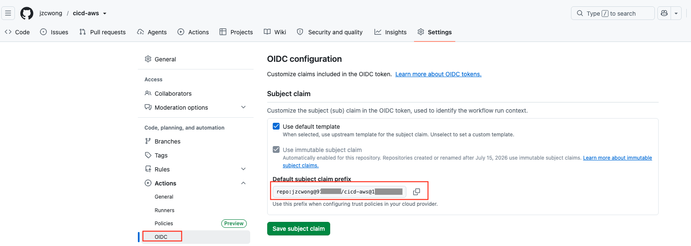
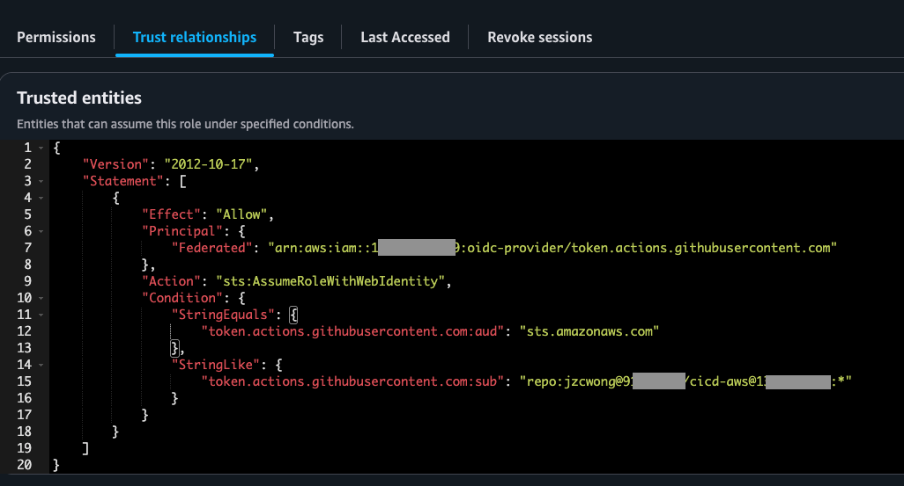

## Changes in Github OIDC claims from 15 July 2026

As per this [article](https://github.blog/changelog/2026-04-23-immutable-subject-claims-for-github-actions-oidc-tokens/) , Github Actions OIDC claims now include immutable identifiers in the **sub** (subject) field of OIDC claims for new repositories created after 15 July 2026. This is to improve the security of OIDC-based trust between your GitHub Actions workflows and cloud providers like AWS, Azure, and GCP.

## Why this change
Previously, the default subject claim used only mutable names (e.g., repo:octocat/my-repo:ref:refs/heads/main). If a repository or organization name was recycled, a new owner could mint tokens with the same subject claim, potentially gaining unauthorized access to cloud resources that still trusted the original identity. The new format appends immutable owner and repository IDs to the claim (e.g., repo:octocat@123456/my-repo@456789:ref:refs/heads/main), ensuring each claim is permanently tied to the original repository.

## Where can you see your default immutable OIDC subject claim?
Go to your Repository > Settings > Actions > OIDC to view the default OIDC subject claim

## What your trust policy in AWS roles should look like?
The AWS role that you create in IAM to allow Github Actions to run tasks in AWS will need to reference the new immutable subject claim from Github, and it looks like the below

