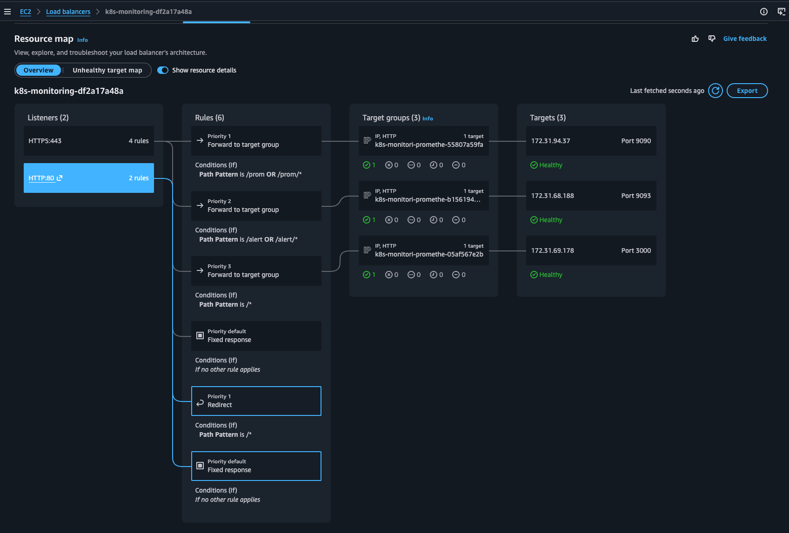
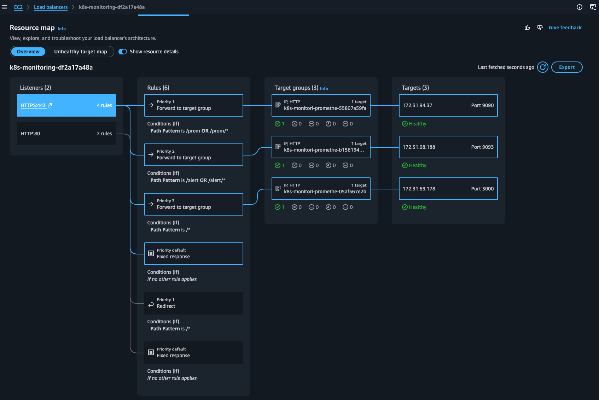
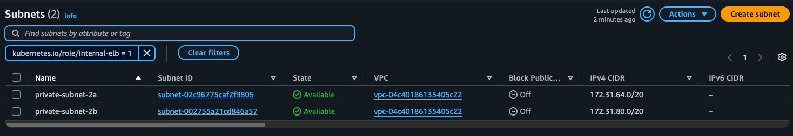
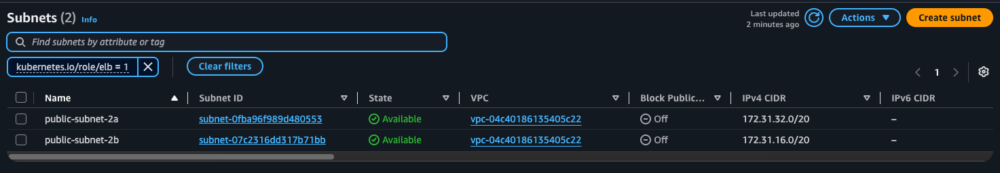
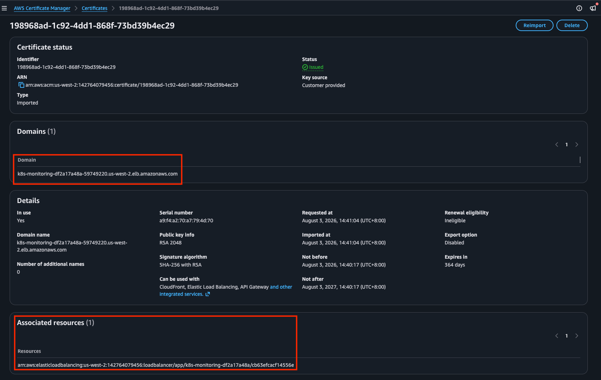
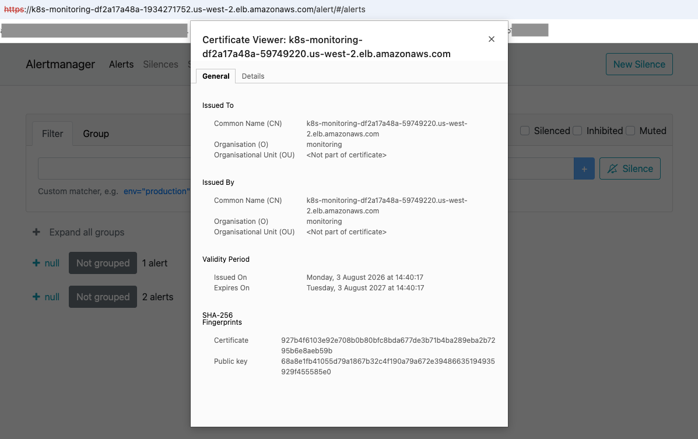
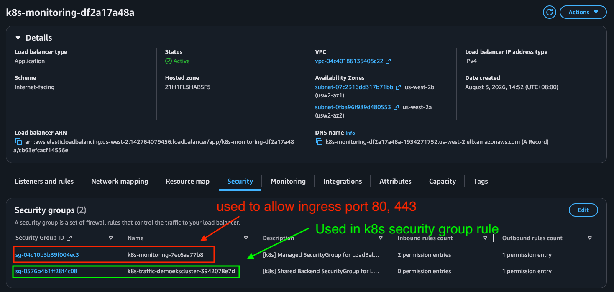
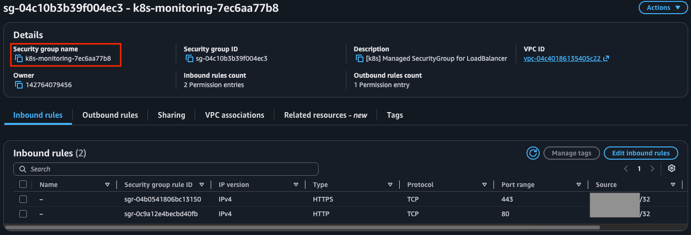
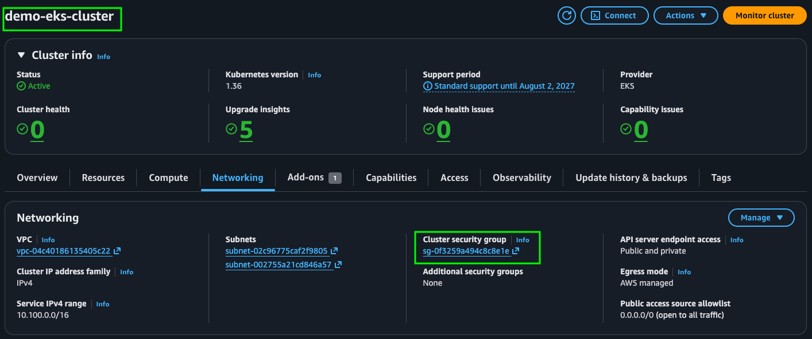
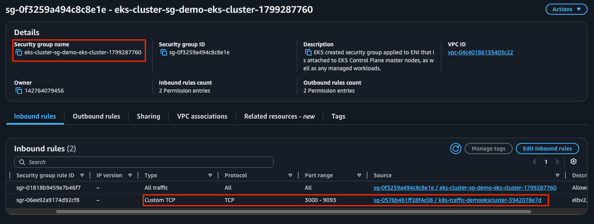

# Installing kube-prometheus-stack on EKS with ALB HTTPS Ingress

In this example, we install prometheus, grafana and alert-manager on an EKS cluster and expose the services via ALB with AWS load balancer controller. We will use the default ALB FQDN to access the services over HTTPS, and use a self-signed certificate on the ALB. 

The security group for the ALB is configured to allow access from only a specific public IP to further lock-down the access. 

> In production please use a proper domain name and certificate on the ALB. Also implement authentication for accessing /prom and /alert paths

## Prerequisites
- EKS cluster up and running
- AWS Load Balancer Controller installed
- EBS CSI Driver installed
- `kubectl` configured to point to your cluster
- `helm` installed
- `aws cli` configured with sufficient permissions
- at least 2 public and 2 private subnets. Public subnets should have the tag *kubernetes.io/role/elb = 1* and private subnets should have the tag *kubernetes.io/role/internal-elb = 1*

---

## Step 1 — Add Helm Repository

```bash
helm repo add prometheus-community https://prometheus-community.github.io/helm-charts
helm repo update
```
---

## Step 2 — Create Namespace
```bash
kubectl create namespace monitoring
```
---

## Step 3 — Install kube-prometheus-stack with Persistent Storage

Check the available storage class:

```bash
kubectl get storageclass
NAME   PROVISIONER             RECLAIMPOLICY   VOLUMEBINDINGMODE      ALLOWVOLUMEEXPANSION   AGE
gp2    kubernetes.io/aws-ebs   Delete          WaitForFirstConsumer   false                  8h
```

Create values-override.yaml:

```yaml
grafana:
  adminPassword: "YourStrongPasswordHere"
  grafana.ini:
    server:
      root_url: "%(protocol)s://%(domain)s/"
      serve_from_sub_path: false
  persistence:
    enabled: true
    storageClassName: gp2    # use gp3 if available
    size: 10Gi
    accessModes:
      - ReadWriteOnce

prometheus:
  prometheusSpec:
    externalUrl: "/prom"
    routePrefix: "/prom"
    retention: 30d
    retentionSize: "45GB"
    storageSpec:
      volumeClaimTemplate:
        spec:
          storageClassName: gp2    # use gp3 if available
          accessModes:
            - ReadWriteOnce
          resources:
            requests:
              storage: 50Gi

alertmanager:
  alertmanagerSpec:
    externalUrl: "http://localhost/alert"   # temporary, will be updated later
    routePrefix: "/alert"

```

> Note: alertmanager.externalUrl is set to http://localhost/alert temporarily.
It will be updated with the actual ALB FQDN in a later step.
A full URL is required — a relative path will cause Alertmanager to crash.

Install the chart:

```bash
helm install prometheus prometheus-community/kube-prometheus-stack \
  -n monitoring \
  -f values-override.yaml
```

Verify all pods are running:

```bash
kubectl get pods -n monitoring
```

Verify PVCs are bound:

```bash
kubectl get pvc -n monitoring
```

Expected output:

```bash
NAME                                                STATUS   VOLUME       CAPACITY   STORAGECLASS   AGE
prometheus-grafana                                  Bound    pvc-xxxxx    10Gi       gp2            1m
prometheus-db-prometheus-kube-prometheus-0          Bound    pvc-xxxxx    50Gi       gp2            1m
```
---

## Step 4 — Create HTTP-only Ingress to get ALB FQDN

> Chicken-and-egg problem: We need the ALB FQDN to generate a self-signed
certificate, but we need the certificate to enable HTTPS on the ALB.
The solution is to create the ALB with HTTP first, get the FQDN,
generate the certificate, then update the ALB to use HTTPS.

Create *monitoring-ingress.yaml* with HTTP only:

```yaml
apiVersion: networking.k8s.io/v1
kind: Ingress
metadata:
  name: prometheus-ingress
  namespace: monitoring
  annotations:
    kubernetes.io/ingress.class: alb
    alb.ingress.kubernetes.io/scheme: internet-facing
    alb.ingress.kubernetes.io/target-type: ip
    alb.ingress.kubernetes.io/listen-ports: '[{"HTTP": 80}]'
    alb.ingress.kubernetes.io/group.name: monitoring
    alb.ingress.kubernetes.io/group.order: "1"
    alb.ingress.kubernetes.io/healthcheck-path: /prom/-/healthy
    alb.ingress.kubernetes.io/success-codes: "200"
    alb.ingress.kubernetes.io/inbound-cidrs: <YOUR-PUBLIC-IP>/32
spec:
  ingressClassName: alb
  rules:
  - http:
      paths:
      - path: /prom
        pathType: Prefix
        backend:
          service:
            name: prometheus-kube-prometheus-prometheus
            port:
              number: 9090
---
apiVersion: networking.k8s.io/v1
kind: Ingress
metadata:
  name: alertmanager-ingress
  namespace: monitoring
  annotations:
    kubernetes.io/ingress.class: alb
    alb.ingress.kubernetes.io/scheme: internet-facing
    alb.ingress.kubernetes.io/target-type: ip
    alb.ingress.kubernetes.io/listen-ports: '[{"HTTP": 80}]'
    alb.ingress.kubernetes.io/group.name: monitoring
    alb.ingress.kubernetes.io/group.order: "2"
    alb.ingress.kubernetes.io/healthcheck-path: /alert/-/healthy
    alb.ingress.kubernetes.io/success-codes: "200"
    alb.ingress.kubernetes.io/inbound-cidrs: <YOUR-PUBLIC-IP>/32
spec:
  ingressClassName: alb
  rules:
  - http:
      paths:
      - path: /alert
        pathType: Prefix
        backend:
          service:
            name: prometheus-kube-prometheus-alertmanager
            port:
              number: 9093
---
apiVersion: networking.k8s.io/v1
kind: Ingress
metadata:
  name: grafana-ingress
  namespace: monitoring
  annotations:
    kubernetes.io/ingress.class: alb
    alb.ingress.kubernetes.io/scheme: internet-facing
    alb.ingress.kubernetes.io/target-type: ip
    alb.ingress.kubernetes.io/listen-ports: '[{"HTTP": 80}]'
    alb.ingress.kubernetes.io/group.name: monitoring
    alb.ingress.kubernetes.io/group.order: "10"
    alb.ingress.kubernetes.io/healthcheck-path: /api/health
    alb.ingress.kubernetes.io/success-codes: "200"
    alb.ingress.kubernetes.io/inbound-cidrs: <YOUR-PUBLIC-IP>/32
spec:
  ingressClassName: alb
  rules:
  - http:
      paths:
      - path: /
        pathType: Prefix
        backend:
          service:
            name: prometheus-grafana
            port:
              number: 80

```

Apply:

```bash
kubectl apply -f monitoring-ingress.yaml
```

Wait for ALB to be provisioned and get the FQDN:

```bash
# Watch until ADDRESS is populated (may take 2-3 minutes)
kubectl get ingress -n monitoring -w

# Once populated, grab the ALB FQDN
ALB_FQDN=$(kubectl get ingress -n monitoring grafana-ingress \
  -o jsonpath='{.status.loadBalancer.ingress[0].hostname}')
echo $ALB_FQDN
```

Expected output:

```bash
k8s-monitoring-xxxx.us-west-2.elb.amazonaws.com
```

---

## Step 5 — Generate Self-Signed Certificate using ALB FQDN

```bash
openssl req -x509 -nodes -days 365 -newkey rsa:2048 \
  -keyout monitoring.key \
  -out monitoring.crt \
  -subj "/CN=${ALB_FQDN}/O=monitoring" \
  -addext "subjectAltName=DNS:${ALB_FQDN}"
```

Verify the certificate:

```bash
openssl x509 -in monitoring.crt -text -noout | grep -E "Subject:|DNS:"
```

Expected output:

```bash
Subject: CN=k8s-monitoring-xxxx.us-west-2.elb.amazonaws.com, O=monitoring
DNS:k8s-monitoring-xxxx.us-west-2.elb.amazonaws.com
```
---

## Step 6 — Import certificate into ACM

```bash
CERT_ARN=$(aws acm import-certificate \
  --certificate fileb://monitoring.crt \
  --private-key fileb://monitoring.key \
  --region us-west-2 \
  --query CertificateArn \
  --output text)

echo $CERT_ARN
```

Expected output:

```bash
arn:aws:acm:us-west-2:<YOUR-ACCOUNT-ID>:certificate/<CERTIFICATE-ID>
```
---

## Step 7 — Update Alertmanager externalUrl with ALB FQDN

Update values-override.yaml with the actual ALB FQDN:

```yaml
grafana:
  adminPassword: "YourStrongPasswordHere"
  grafana.ini:
    server:
      root_url: "%(protocol)s://%(domain)s/"
      serve_from_sub_path: false
  persistence:
    enabled: true
    storageClassName: gp2
    size: 10Gi
    accessModes:
      - ReadWriteOnce

prometheus:
  prometheusSpec:
    externalUrl: "/prom"
    routePrefix: "/prom"
    retention: 30d
    retentionSize: "45GB"
    storageSpec:
      volumeClaimTemplate:
        spec:
          storageClassName: gp2
          accessModes:
            - ReadWriteOnce
          resources:
            requests:
              storage: 50Gi

alertmanager:
  alertmanagerSpec:
    externalUrl: "https://<ALB-FQDN>/alert"   # <-- replace with actual ALB FQDN
    routePrefix: "/alert"

```

Apply the update:

```bash
helm upgrade prometheus prometheus-community/kube-prometheus-stack \
  -n monitoring \
  -f values-override.yaml
```

---

## Step 8 — Update Ingress to HTTPS with Certificate and HTTP Redirect

Update monitoring-ingress.yaml with the certificate ARN and HTTPS configuration:
```yaml
apiVersion: networking.k8s.io/v1
kind: Ingress
metadata:
  name: http-redirect-ingress
  namespace: monitoring
  annotations:
    kubernetes.io/ingress.class: alb
    alb.ingress.kubernetes.io/scheme: internet-facing
    alb.ingress.kubernetes.io/target-type: ip
    alb.ingress.kubernetes.io/listen-ports: '[{"HTTP": 80}, {"HTTPS": 443}]'
    alb.ingress.kubernetes.io/certificate-arn: <YOUR-CERT-ARN>
    alb.ingress.kubernetes.io/actions.ssl-redirect: |
      {"type": "redirect", "redirectConfig": {"protocol": "HTTPS", "port": "443", "statusCode": "HTTP_301"}}
    alb.ingress.kubernetes.io/group.name: monitoring
    alb.ingress.kubernetes.io/group.order: "0"
    alb.ingress.kubernetes.io/inbound-cidrs: <YOUR-PUBLIC-IP>/32
spec:
  ingressClassName: alb
  rules:
  - http:
      paths:
      - path: /
        pathType: Prefix
        backend:
          service:
            name: ssl-redirect
            port:
              name: use-annotation
---
apiVersion: networking.k8s.io/v1
kind: Ingress
metadata:
  name: prometheus-ingress
  namespace: monitoring
  annotations:
    kubernetes.io/ingress.class: alb
    alb.ingress.kubernetes.io/scheme: internet-facing
    alb.ingress.kubernetes.io/target-type: ip
    alb.ingress.kubernetes.io/listen-ports: '[{"HTTP": 80}, {"HTTPS": 443}]'
    alb.ingress.kubernetes.io/certificate-arn: <YOUR-CERT-ARN>
    alb.ingress.kubernetes.io/group.name: monitoring
    alb.ingress.kubernetes.io/group.order: "1"
    alb.ingress.kubernetes.io/healthcheck-path: /prom/-/healthy
    alb.ingress.kubernetes.io/success-codes: "200"
    alb.ingress.kubernetes.io/inbound-cidrs: <YOUR-PUBLIC-IP>/32
spec:
  ingressClassName: alb
  rules:
  - http:
      paths:
      - path: /prom
        pathType: Prefix
        backend:
          service:
            name: prometheus-kube-prometheus-prometheus
            port:
              number: 9090
---
apiVersion: networking.k8s.io/v1
kind: Ingress
metadata:
  name: alertmanager-ingress
  namespace: monitoring
  annotations:
    kubernetes.io/ingress.class: alb
    alb.ingress.kubernetes.io/scheme: internet-facing
    alb.ingress.kubernetes.io/target-type: ip
    alb.ingress.kubernetes.io/listen-ports: '[{"HTTP": 80}, {"HTTPS": 443}]'
    alb.ingress.kubernetes.io/certificate-arn: <YOUR-CERT-ARN>
    alb.ingress.kubernetes.io/group.name: monitoring
    alb.ingress.kubernetes.io/group.order: "2"
    alb.ingress.kubernetes.io/healthcheck-path: /alert/-/healthy
    alb.ingress.kubernetes.io/success-codes: "200"
    alb.ingress.kubernetes.io/inbound-cidrs: <YOUR-PUBLIC-IP>/32
spec:
  ingressClassName: alb
  rules:
  - http:
      paths:
      - path: /alert
        pathType: Prefix
        backend:
          service:
            name: prometheus-kube-prometheus-alertmanager
            port:
              number: 9093
---
apiVersion: networking.k8s.io/v1
kind: Ingress
metadata:
  name: grafana-ingress
  namespace: monitoring
  annotations:
    kubernetes.io/ingress.class: alb
    alb.ingress.kubernetes.io/scheme: internet-facing
    alb.ingress.kubernetes.io/target-type: ip
    alb.ingress.kubernetes.io/listen-ports: '[{"HTTP": 80}, {"HTTPS": 443}]'
    alb.ingress.kubernetes.io/certificate-arn: <YOUR-CERT-ARN>
    alb.ingress.kubernetes.io/group.name: monitoring
    alb.ingress.kubernetes.io/group.order: "10"
    alb.ingress.kubernetes.io/healthcheck-path: /api/health
    alb.ingress.kubernetes.io/success-codes: "200"
    alb.ingress.kubernetes.io/inbound-cidrs: <YOUR-PUBLIC-IP>/32
spec:
  ingressClassName: alb
  rules:
  - http:
      paths:
      - path: /
        pathType: Prefix
        backend:
          service:
            name: prometheus-grafana
            port:
              number: 80

```

Apply:
```bash
kubectl apply -f monitoring-ingress.yaml
```

Verify all ingresses are updated:
```bash
kubectl get ingress -n monitoring
```

---

## Step 9 — Verify

Access the FQDN of the ALB and it should direct you to Grafana login page. Obtain the password to log into Grafana

```bash
echo "Password: $(kubectl get secret -n monitoring prometheus-grafana \
  -o jsonpath="{.data.admin-password}" | base64 --decode)"
```

Access https://ALB-FQDN/prom and that should direct you to Prometheus

Access https://ALB-FQDN/alert and that should direct you to alert-manager


---

## Relevant screenshots

HTTP redirection on ALB



HTTPS target groups on ALB



Private subnet tags



Public subnet tags



ACM



Invalid Certificate due to self-signed



Two security groups on ALB - one for ingress traffic and the other is used in EKS security group rule






Security group on EKS







