# Example of a cross-account cross-region AWS privatelink setup

In this example, AWS Privatelink is set up to allow a consumer Account A in us-west-2 to access a webserver in Provider Account B in us-east-1 such that the traffic traverses over AWS private backbone instead of Internet

In addition, a Route53 private hosted zone is set up in Account A and linked to the consumer VPC to allow simplified DNS resolution for the VPC endpoint set up in Account A. This step is optional but it is implemented in this example for completeness.

The CIDRs used in the VPCs below are for illustration and differ from the actual ones used in this test.

```
Account A (us-west-2)                        Account B (us-east-1)
┌─────────────────────────┐                 ┌──────────────────────────┐
│  Consumer VPC           │                 │  Provider VPC            │
│  10.0.0.0/16            │                 │  10.1.0.0/16             │
│                         │                 │                          │
│  ┌──────────┐           │  AWS PrivateLink│  ┌─────┐   ┌─────────┐  │
│  │ Test EC2 ├──►VPC     ├─────────────────┤  │ NLB ├──►│  EC2    │  │
│  └──────────┘  Endpoint │  (cross-region) │  └─────┘   │ httpd   │  │
│                         │                 │            └─────────┘  │
└─────────────────────────┘                 └──────────────────────────┘
        No intermediate VPC needed! ✅
```

## Set up in Provider Account B (us-east-1)
1. Create a Security Group that allows inbound TCP port 80 from Account A's VPC CIDR and also all traffic from the same security group. The screenshot below includes SSH port 22 inbound for management testing purpose only

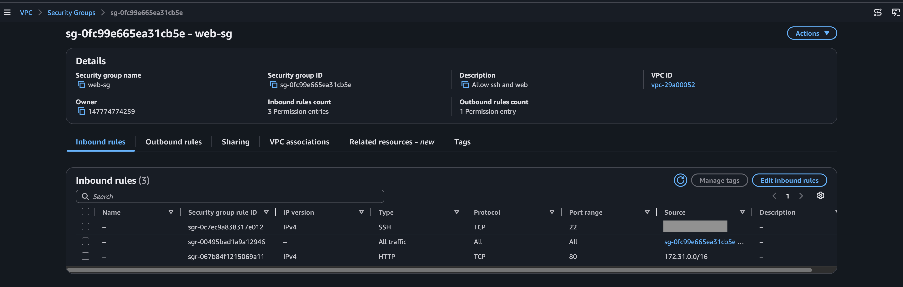

---

2. Spin up EC2 instance with httpd web server installed, and attach the security group created in Step 1

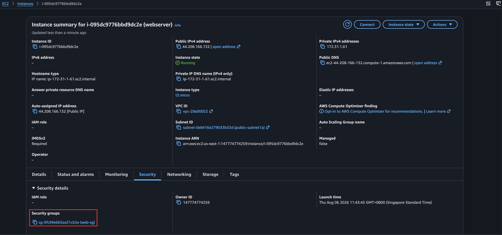

---

3. Create a Target Group with the EC2 instance. Private Link only supports TCP/UDP, so the Target Group is configured to send traffic to the EC2 on TCP port 80

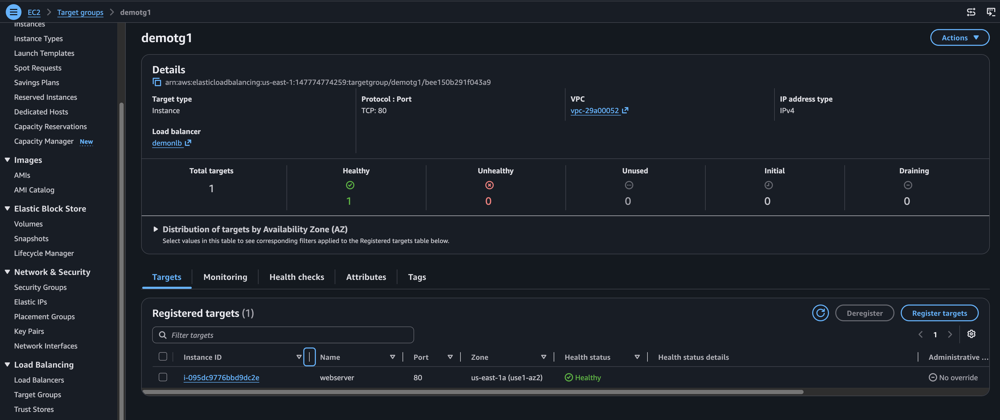

---

4. Create NLB and use the Target Group in step 2, attach the Security Group in step 1 to the NLB

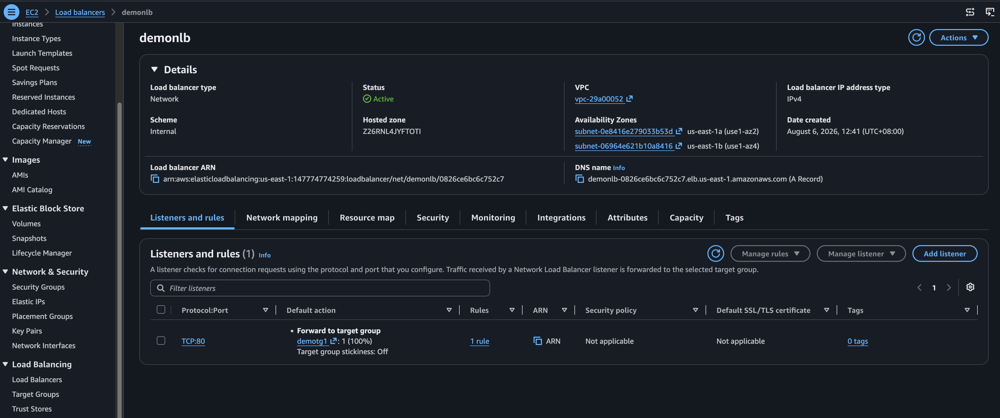

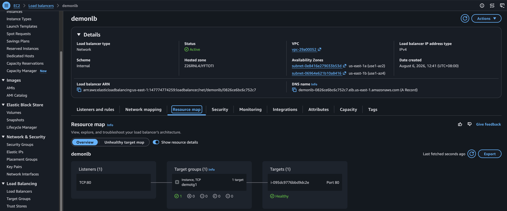

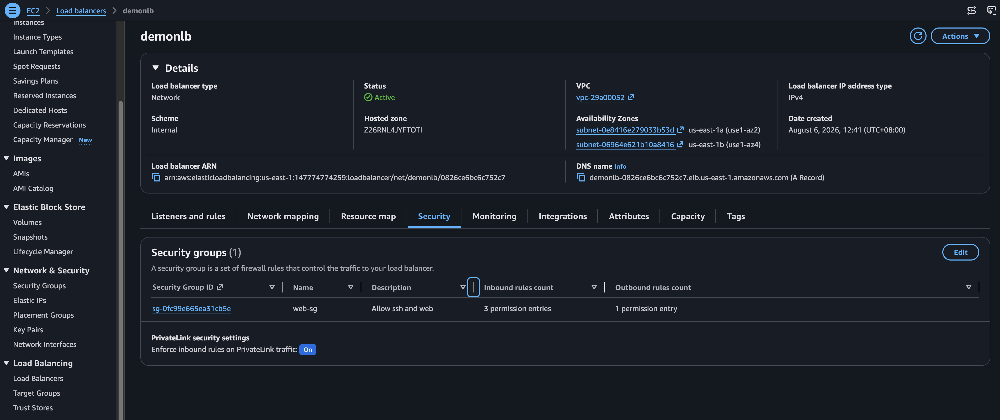

---

5. On the VPC in Account B, create VPC EndPoint Service.

The VPC Endpoint Service should:
- reference the NLB in Step 4
- set Allow principals to the AWS account ID of consumer
- set the Supported regions to include the region of the consumer AWS VPC


reference the NLB in Step 4
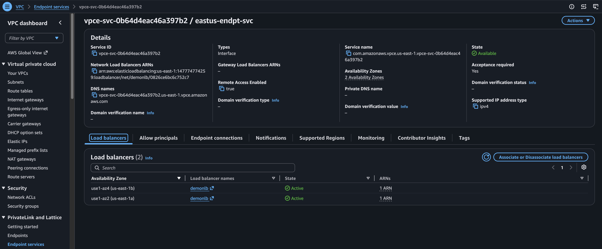

set Allow principals to the AWS account ID of consumer
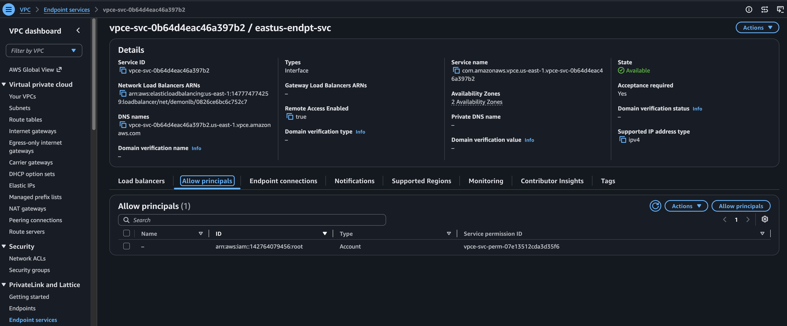

The format for the allowed principal is

```
arn : aws : iam : : 123456789012 : root
 │     │     │    │       │         │
 │     │     │    │       │         └── resource: "root" means
 │     │     │    │       │              the entire AWS account
 │     │     │    │       │              (all principals)
 │     │     │    │       │
 │     │     │    │       └── account-id: 12-digit AWS account number
 │     │     │    │
 │     │     │    └── region: EMPTY - IAM is a global service
 │     │     │                so region is always blank
 │     │     │
 │     │     └── service: iam
 │     │
 │     └── partition: aws (commercial)
 │                    aws-cn (China)
 │                    aws-us-gov (GovCloud)
 │
 └── literal prefix: always "arn"
```

set the Supported regions to include the region of the consumer AWS VPC

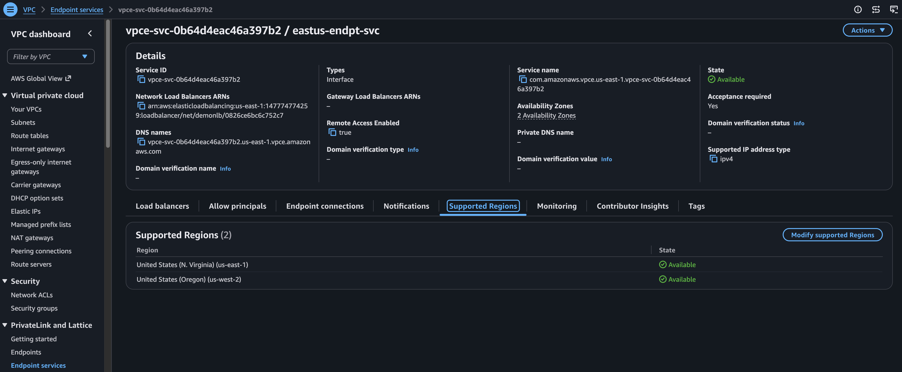


## Set up in Consumer Account A (us-west-2)

1. Set up the web client EC2 in the target VPC and subnet, the security group attached should allow egress access to all networks

2. Set up the VPC interface endpoint into the subnet(s) where the web client EC2 is running. The *Service Name* is obtained from the Provider's VPC Endpoint Service name, and the *Service region* is the region where the Provider VPC endpoint service is created. Use the same security group as the EC2 in step 1 for simplicity. After this is set up, a request will be automatically made to the Provider VPC Endpoint service that has to be approved before the PrivateLink can be established

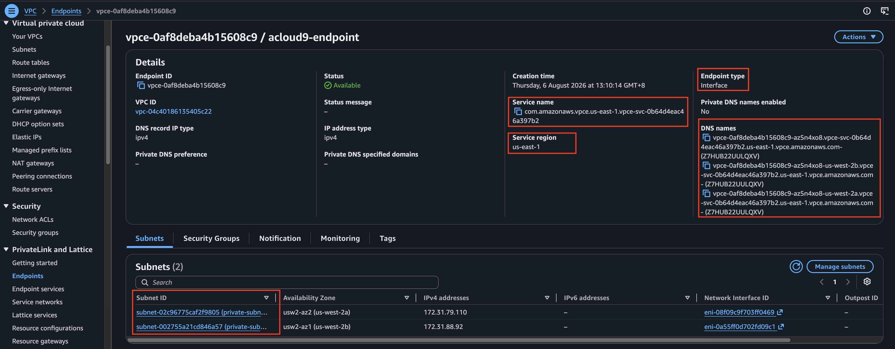

3. Go to the Provider Account B, navigate to VPC Endpoint service and approve the incoming connection request

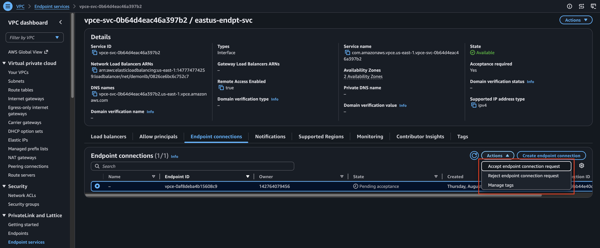

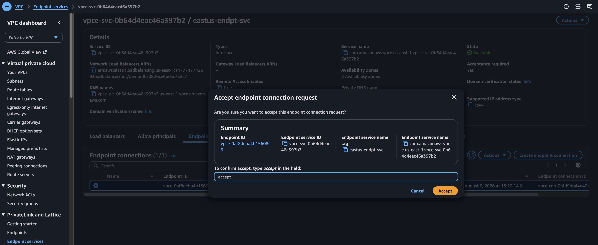

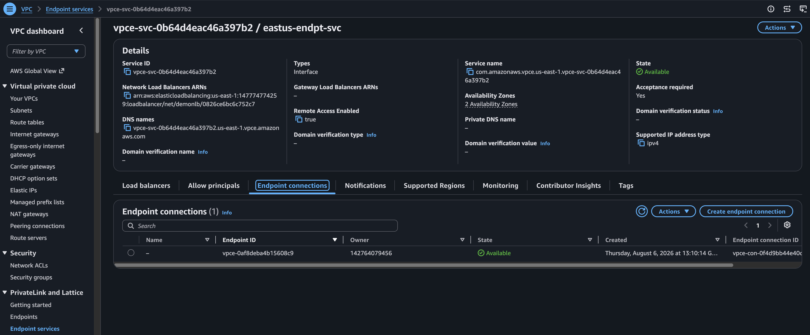

4. From the web client EC2, test name resolution and HTTP connectivity to the VPC Endpoint FQDN

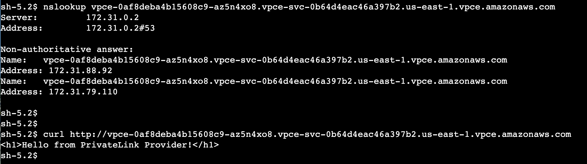

5. Set up private Route53 hosted zone to allow web client to access the VPC Endpoint FQDN via a simple url like acloud9.sh . This is done with an A record with an Alias pointing to the FQDN of the VPC Endpoint in Account A

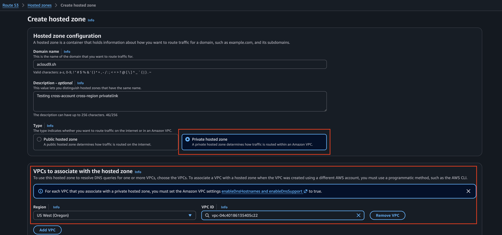

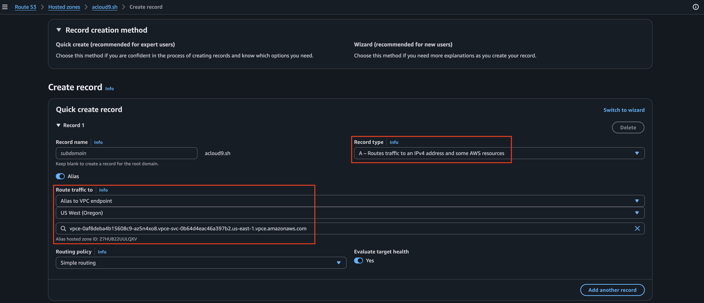

6. Test the name resolution again from web client EC2

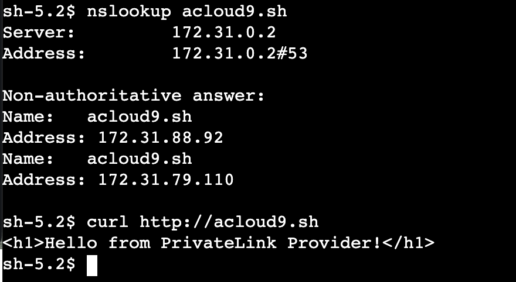
