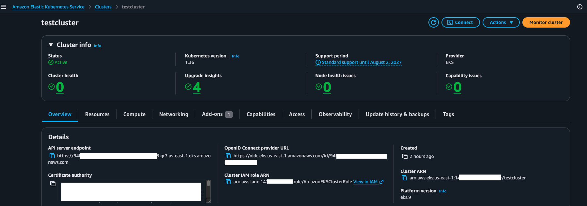
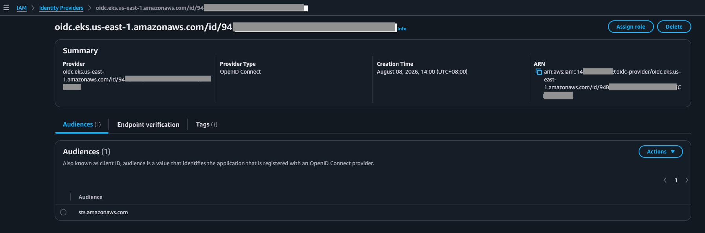
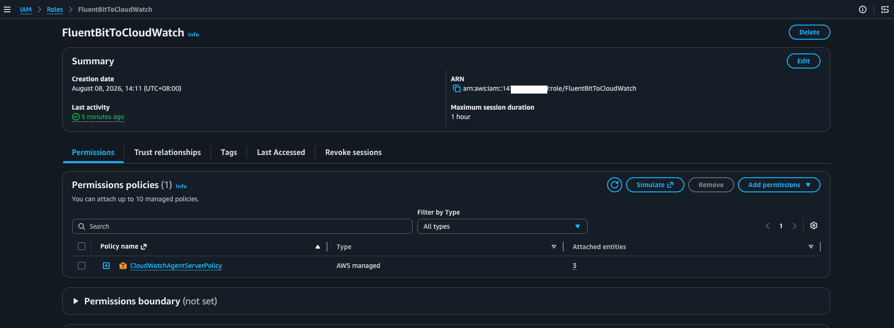
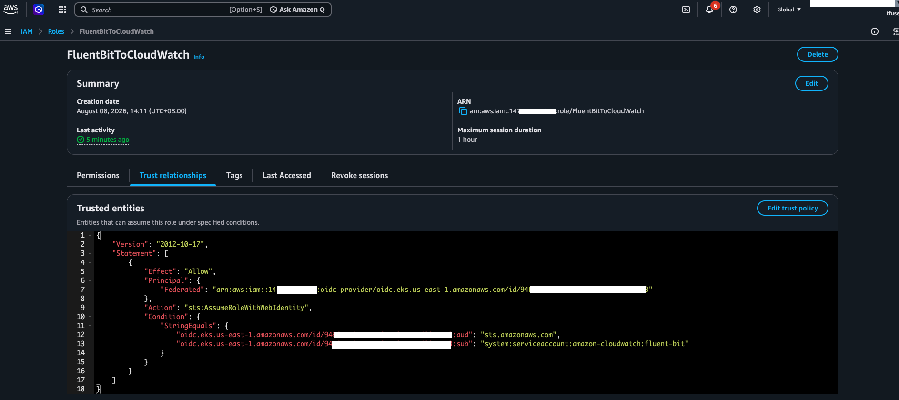
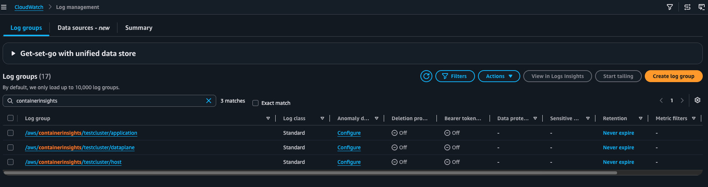

## Reference document - https://docs.aws.amazon.com/AmazonCloudWatch/latest/monitoring/Container-Insights-setup-logs-FluentBit.html

This document explains how to set up FluentBit in AWS EKS cluster to send logs from all pods to CloudWatch. It uses IAM Roles for Service Accounts or IRSA for permissions. The fluentbit pods will use a Service Account that is annotated to use an IAM role that has been created in the console. This IAM role provides permissions to create Cloudwatch Log Groups and to write logs to them, and is configured to trust the EKS OIDC as an Identity provider on the condition it sees a matching service account name and namespace. In this way, only that specific Service Account called *fluent-bit* in the namespace *amazon-cloudwatch* can use this role and not any other resources from the EKS cluster

## Step 1
Set up OIDC Identity Provider in IAM trusting the EKS as an OIDC provider






## Step 2
Create an IAM role with the policy *CloudWatchAgentServerPolicy* and set the following trust policy 

```json
{
    "Version": "2012-10-17",
    "Statement": [
        {
            "Effect": "Allow",
            "Principal": {
                "Federated": "arn:aws:iam::<ACCOUNT-ID>:oidc-provider/oidc.eks.us-east-1.amazonaws.com/id/<OIDC-ID>"
            },
            "Action": "sts:AssumeRoleWithWebIdentity",
            "Condition": {
                "StringEquals": {
                    "oidc.eks.us-east-1.amazonaws.com/id/<OIDC-ID>:sub": "system:serviceaccount:<FLUENTBIT-NAMESPACE>:<FLUENTBIT-SERVICE-ACCOUNT-NAME>",
                    "oidc.eks.us-east-1.amazonaws.com/id/<OIDC-ID>:aud": "sts.amazonaws.com"
                }
            }
        }
    ]
}

```






## Step 3
create the namespace 

```bash
kubectl apply -f https://raw.githubusercontent.com/aws-samples/amazon-cloudwatch-container-insights/latest/k8s-deployment-manifest-templates/deployment-mode/daemonset/container-insights-monitoring/cloudwatch-namespace.yaml
```


## Step 4
Create the configmap

```bash
ClusterName=testcluster
RegionName=us-east-1
FluentBitHttpPort='2020'
FluentBitReadFromHead='Off'
[[ ${FluentBitReadFromHead} = 'On' ]] && FluentBitReadFromTail='Off'|| FluentBitReadFromTail='On'
[[ -z ${FluentBitHttpPort} ]] && FluentBitHttpServer='Off' || FluentBitHttpServer='On'

kubectl create configmap fluent-bit-cluster-info \
--from-literal=cluster.name=${ClusterName} \
--from-literal=http.server=${FluentBitHttpServer} \
--from-literal=http.port=${FluentBitHttpPort} \
--from-literal=read.head=${FluentBitReadFromHead} \
--from-literal=read.tail=${FluentBitReadFromTail} \
--from-literal=logs.region=${RegionName} -n amazon-cloudwatch

```


## Step 5

If you want the Fluent Bit optimized configuration for Linux computers, run this command.

```
kubectl apply -f https://raw.githubusercontent.com/aws-samples/amazon-cloudwatch-container-insights/latest/k8s-deployment-manifest-templates/deployment-mode/daemonset/container-insights-monitoring/fluent-bit/fluent-bit.yaml
```


## Step 6
Check the SA created in the amazon-cloudwatch namespace and then annotate it to use the role created in step 2. Alternatively you can download and modify the yaml file in step 5 to include this annotation before applying it. This way you do not need to annotate the SA after it is created and you can skip Step 6 and 7 altogether

```bash
kubectl get sa -n amazon-cloudwatch
NAME         AGE
default      60m
fluent-bit   57m
```

```bash
kubectl annotate sa fluent-bit -n amazon-cloudwatch \
eks.amazonaws.com/role-arn=arn:aws:iam::<ACCOUNT-ID>:role/FluentBitToCloudWatch


kubectl describe sa fluent-bit -n amazon-cloudwatch
Name:                fluent-bit
Namespace:           amazon-cloudwatch
Labels:              <none>
Annotations:         eks.amazonaws.com/role-arn: arn:aws:iam::<ACCOUNT-ID>:role/FluentBitToCloudWatch
Image pull secrets:  <none>
Events:              <none>
```

## Step 7
Do a rollout restart of the fluentbit daemonset

```bash
kubectl rollout restart daemonset fluent-bit -n amazon-cloudwatch

kubectl get pods -n amazon-cloudwatch
NAME               READY   STATUS    RESTARTS   AGE
fluent-bit-jzpct   1/1     Running   0          18m
fluent-bit-vv5pd   1/1     Running   0          18m
```

Check that you have the following log groups created in Cloudwatch in the same region as your cluster

/aws/containerinsights/Cluster_Name/application

/aws/containerinsights/Cluster_Name/host

/aws/containerinsights/Cluster_Name/dataplane




## Step 8
Optionally create a pod that logs every 5s and check that its log appear in */aws/containerinsights/Cluster_Name/application*

```bash
cat <<EOF | kubectl apply -f -
apiVersion: apps/v1
kind: Deployment
metadata:
  name: continuous-log-generator
  namespace: default
spec:
  replicas: 1
  selector:
    matchLabels:
      app: log-generator
  template:
    metadata:
      labels:
        app: log-generator
    spec:
      containers:
      - name: generator
        image: busybox:latest
        command: ["/bin/sh", "-c"]
        args:
        - >
          while true; do
            echo "{\"timestamp\": \"$(date -u +'%Y-%m-%dT%H:%M:%SZ')\", \"level\": \"INFO\", \"message\": \"FluentBit validation heartbeat check from default namespace\", \"count\": \${COUNT:-0}}";
            COUNT=\$((COUNT+1));
            sleep 5;
          done
EOF
```

