## Example of SQS + Lambda + SNS + DynamoDB integration

This is a simple example showing integration of *SQS + Lambda + SNS + DynamoDB* services. When messages are placed into a SQS queue, a Python-based Lambda function is triggered which retrieves the message from the queue and deletes it. The Lambda function then uses SNS email notification to send an email with the SQS message contents, and at the same time inserts the message contents into DynamoDB

---
### Step 1 - Create the SNS topic and email notification

Create SNS topic and set an email address to receive the notifications from SNS

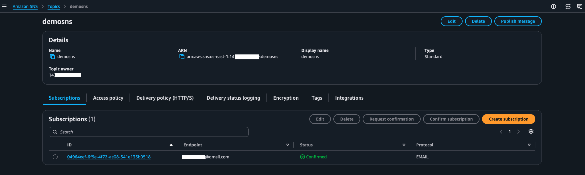

Log into the email and confirm subscription

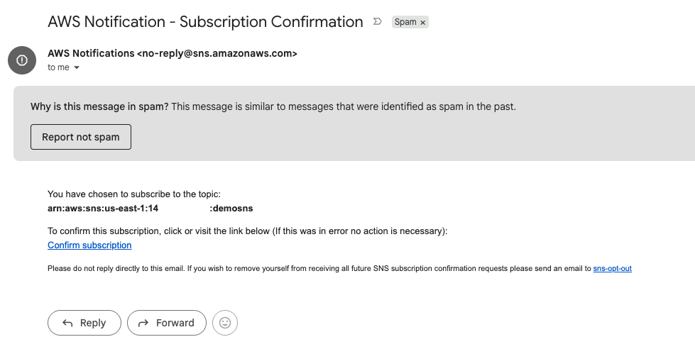

Successful subscription

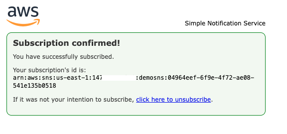

---
### Step 2 - Create the DynamoDB table

Create the dynamoDB table and set the partition key as *messageId*

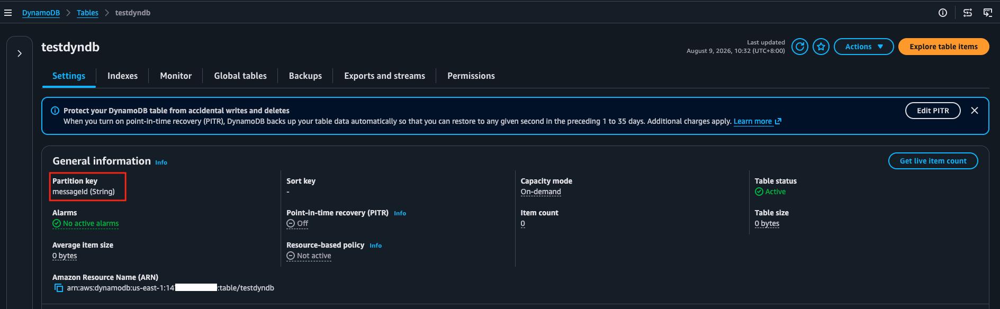

---
### Step 3 - Create IAM policy and role for the Lambda function

The Lambda function needs permissions to retrieve messages from the SQS queue and delete messages after retrieval, it also needs to be able to send SNS notifications and insert entries into DynamoDB table. In addition, it should have permissions to create CloudWatch log groups for logging

Create the custom policy first

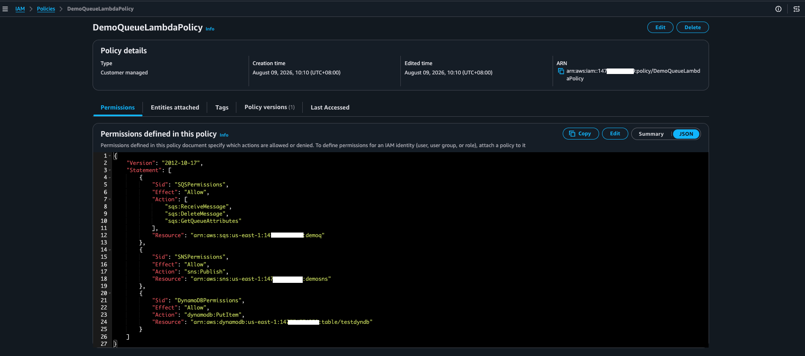

Create the IAM role and attach the custom policy in addition to the default one

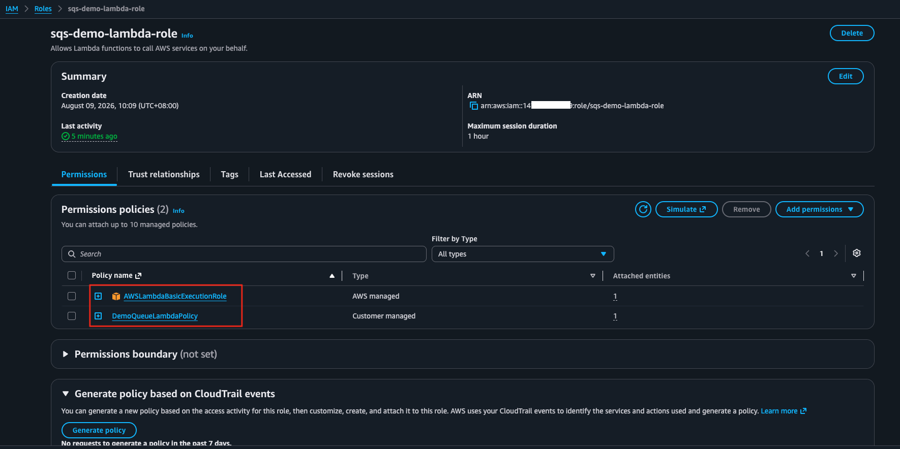

Verify the IAM role trust policy

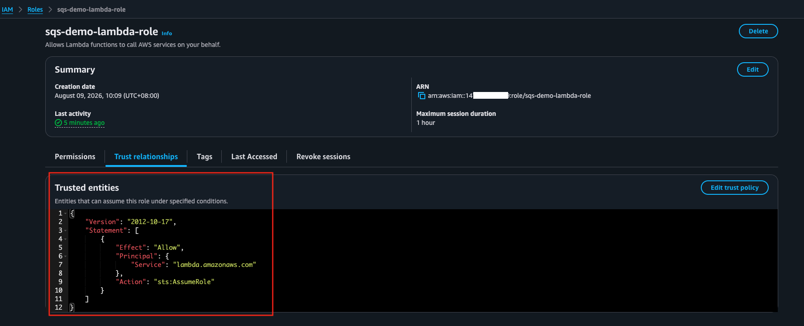

---
### Step 4 - Create Lambda function

Create the Lambda function with the code below

```python
import json
import os
import boto3
from datetime import datetime, timezone
import uuid

# Initialize AWS clients (outside the handler so they're reused across invocations)
sns = boto3.client('sns')
dynamodb = boto3.resource('dynamodb')

# --- CONFIG: set these as Lambda environment variables ---
SNS_TOPIC_ARN = os.environ['SNS_TOPIC_ARN']
DYNAMODB_TABLE_NAME = os.environ['DYNAMODB_TABLE_NAME']

table = dynamodb.Table(DYNAMODB_TABLE_NAME)


def lambda_handler(event, context):
    """
    Triggered by SQS. Each invocation may contain multiple messages (a batch).
    For each message: send an SNS email notification and save it to DynamoDB.
    """

    for record in event['Records']:
        message_body = record['body']
        message_id = record['messageId']

        print(f"Processing message {message_id}: {message_body}")

        # 1. Send SNS notification (email)
        sns.publish(
            TopicArn=SNS_TOPIC_ARN,
            Subject='New SQS Message Received',
            Message=f"A new message was received:\n\n{message_body}"
        )

        # 2. Save message to DynamoDB
        table.put_item(
            Item={
                'messageId': message_id,           # partition key
                'body': message_body,
                'receivedAt': datetime.now(timezone.utc).isoformat()
            }
        )

        print(f"Successfully processed message {message_id}")

    return {
        'statusCode': 200,
        'body': json.dumps('Processing complete')
    }
```

Set the environment variables used by Lambda - the ARN of SNS and DynamoDB table name

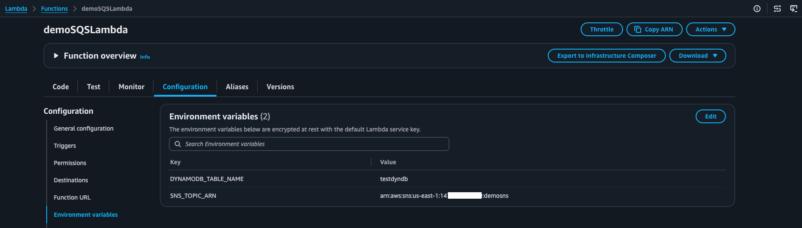

Set the role used by Lambda function

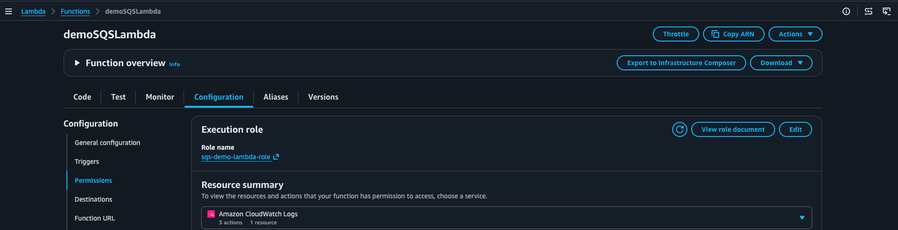

---
### Step 5 - create the SQS queue

Create the SQS queue and set the Lambda trigger. SQS queue uses the default access policy

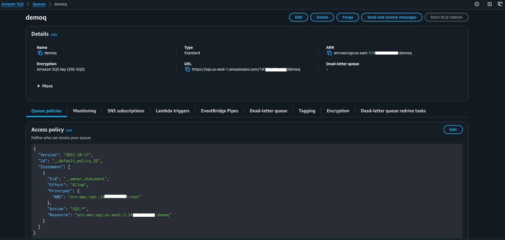

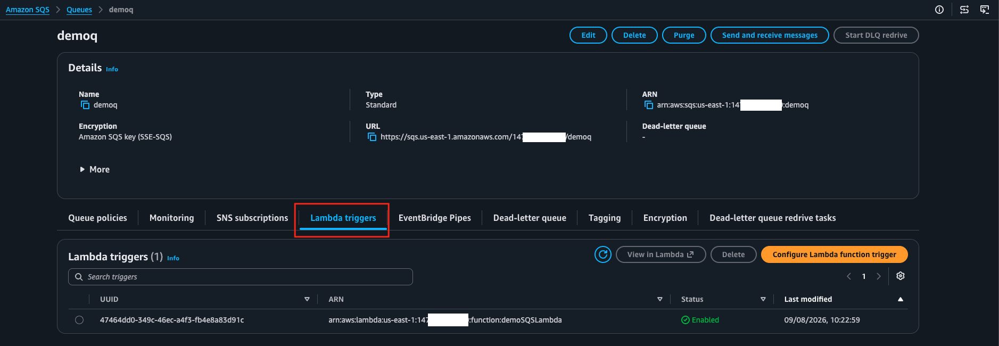

---
### Step 6 - send message to SQS queue and verify

Send message

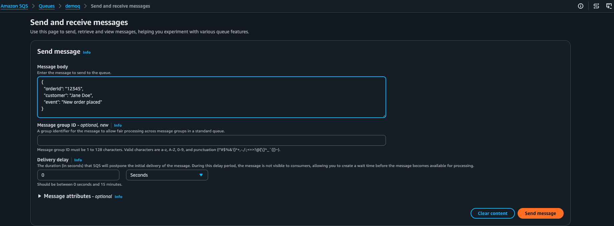

Receive email

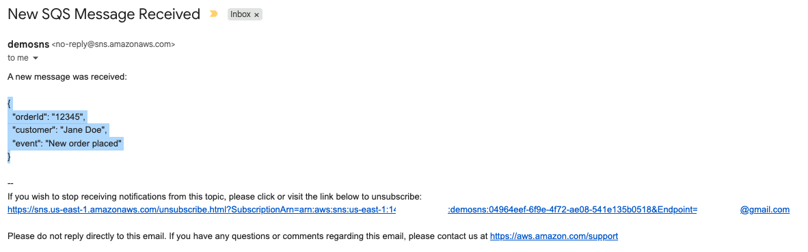

DynamoDB entry appears

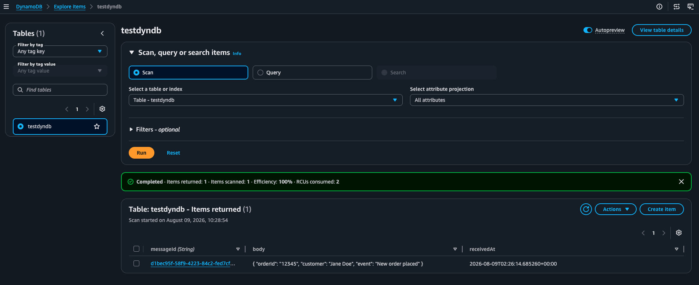

Cloudwatch logs appear

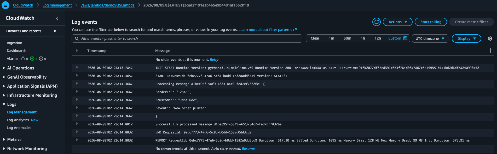

