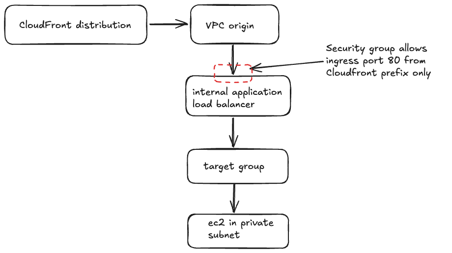
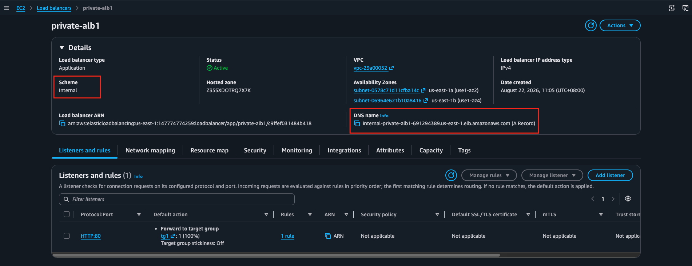
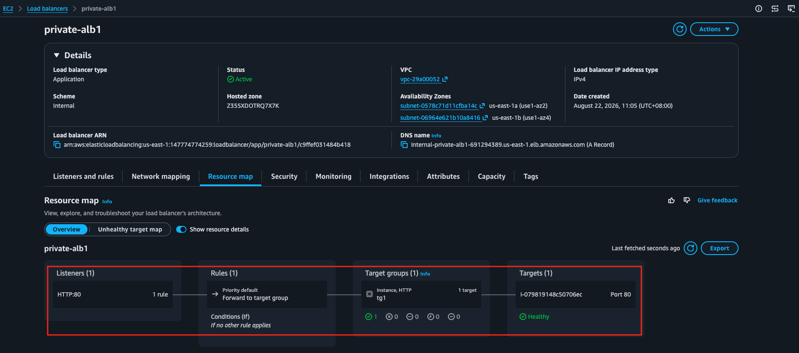
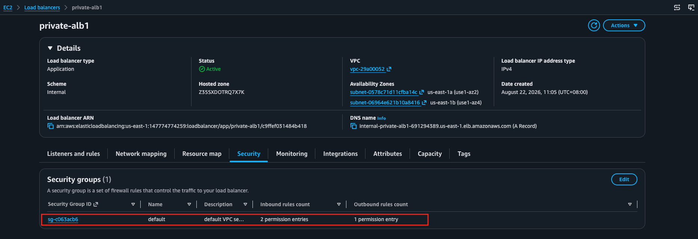
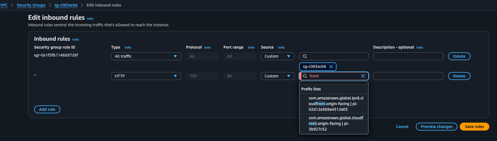
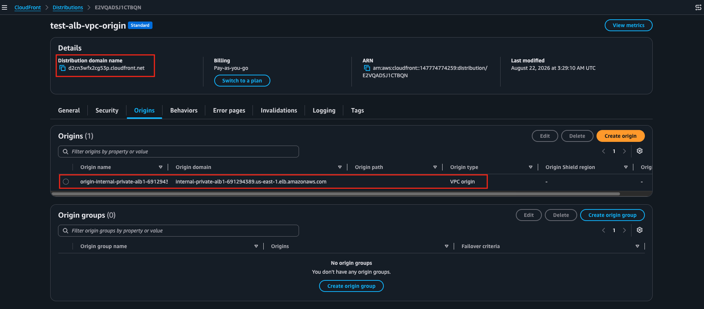
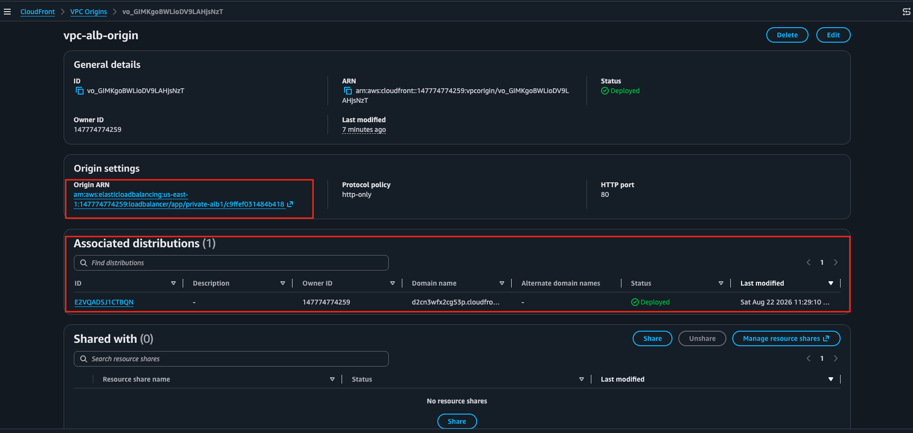
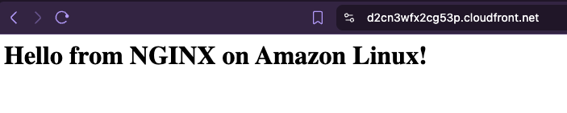

## Using CloudFront with VPC Origin
VPC Origin lets your CloudFront distribution deliver content from applications hosted in a private VPC subnet. It keeps your backend hidden from the public internet. Traffic flows securely through managed endpoints without needing public IP addresses on your servers

In this example, the following is set up:

Pre-requisite:
- EC2 with web service running in a private subnet
- Target group created with the EC2 instance
- Internal application load balancer created listening in HTTP port 80 and using the target group

---

### Internal application load balancer details

---

### Internal application load balancer resource map

---

### Internal application load balancer security group

---

Make sure to include the prefix list for Cloudfront in ingress rules for port 80

---

### CloudFront distribution and VPC origin details

---

---

### Results

