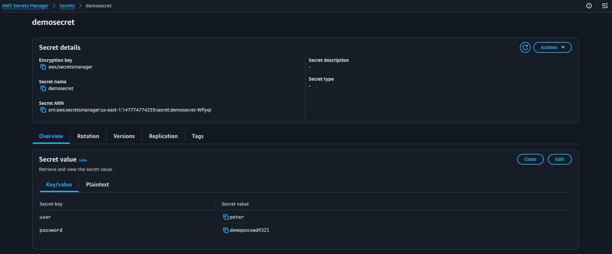
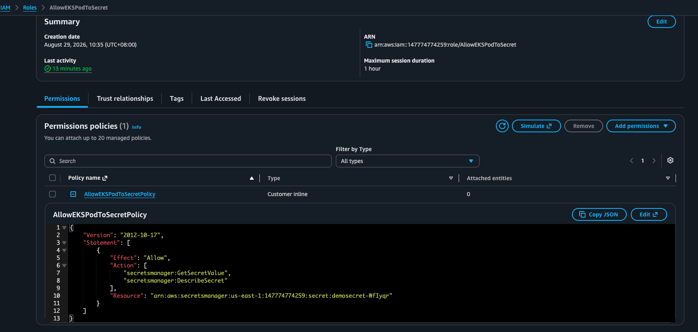
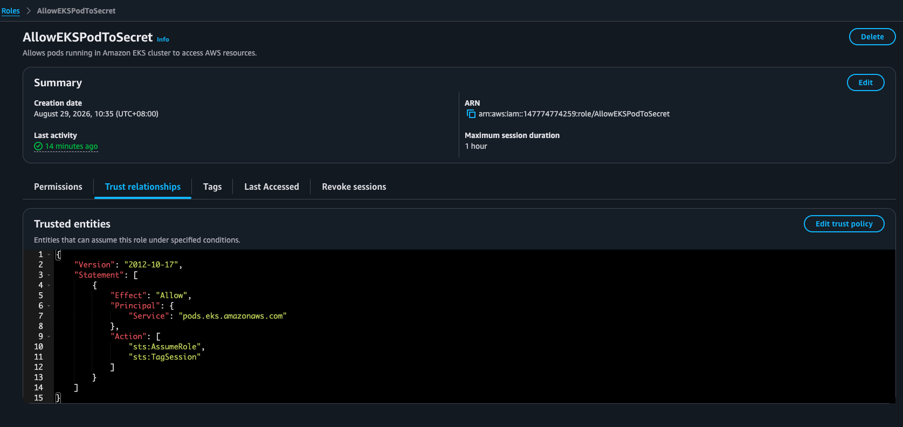
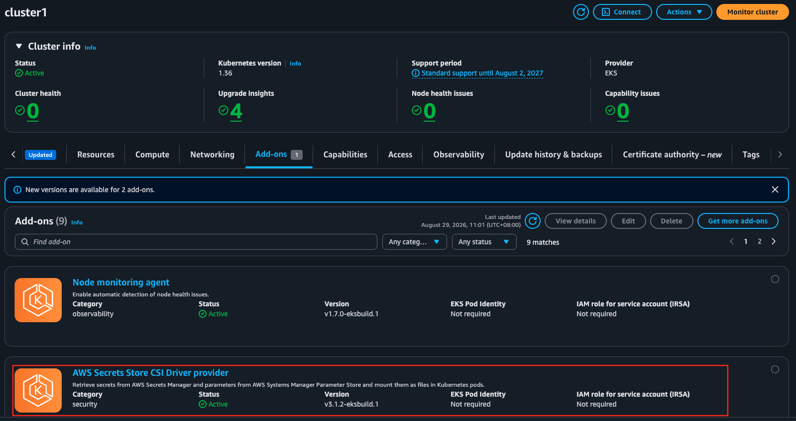
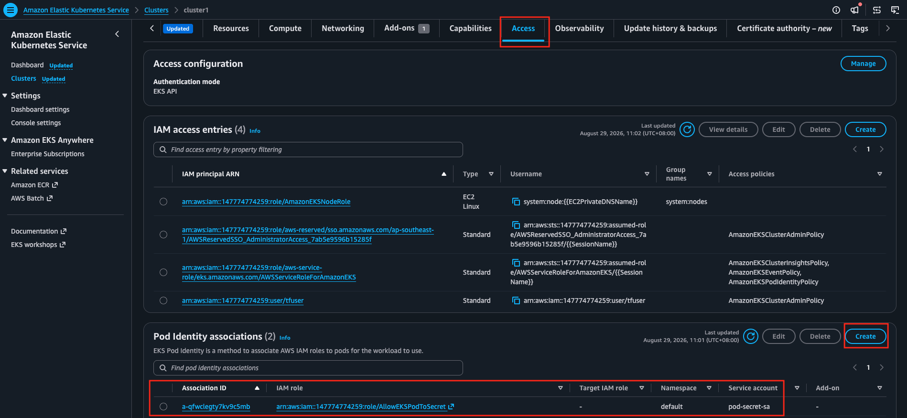
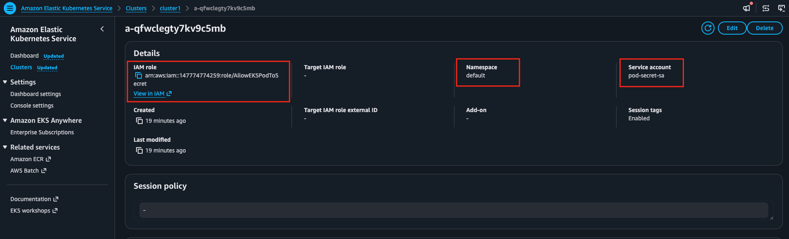

## Introduction

This is an example that shows how to use AWS Secrets Store CSI driver and Pod Identities to allow EKS pods to mount secrets from Secrets Store as read-only volumes


### Step 1 - Create the secret in Secrets Manager



---

### Step 2 - Create the IAM role that allows EKS pods to access the secret

Trust-policy
```json
{
    "Version": "2012-10-17",
    "Statement": [
        {
            "Effect": "Allow",
            "Principal": {
                "Service": "pods.eks.amazonaws.com"
            },
            "Action": [
                "sts:AssumeRole",
                "sts:TagSession"
            ]
        }
    ]
}

```

Permission policy that targets ARN of secret created in Step 1
```json
{
	"Version": "2012-10-17",
	"Statement": [
		{
			"Effect": "Allow",
			"Action": [
				"secretsmanager:GetSecretValue",
				"secretsmanager:DescribeSecret"
			],
			"Resource": "arn:aws:secretsmanager:us-east-1:147774774259:secret:demosecret-WfIyqr"
		}
	]
}
```





---

### Step 3 - Configure the pod identity role association on the EKS cluster

Make sure the secrets-store CSI driver add-on is available 



Configure the pod ID association in Access tab for EKS cluster. You can specify a non-existent service account or an existing one. If the service account is non-existent you will need to create it in step 5. 






---

### Step 4 - Create the SecretProviderClass that references the secret, make sure to set *usePodIdentity* as true
```yaml
apiVersion: secrets-store.csi.x-k8s.io/v1 
kind: SecretProviderClass 
metadata: 
  name: aws-secrets 
spec: 
  provider: aws 
  parameters: 
    objects: |
      - objectName: "demosecret"
        objectType: "secretsmanager"
    usePodIdentity: "true"
```

---

### Step 5 - create the service account, there is no need to annotate the service account pointing it to the IAM role unlike IRSA

```yaml
apiVersion: v1
kind: ServiceAccount
metadata:
  name: pod-secret-sa
  namespace: default
```
---

### Step 6 - Create the pod that mounts the secret as a readable volume
```yaml
kind: Service
apiVersion: v1
metadata:
  name: nginx-pod-identity-deployment
  labels:
    app: nginx-pod-identity
spec:
  selector:
    app: nginx-pod-identity
  ports:
    - protocol: TCP
      port: 80
      targetPort: 80
---
apiVersion: apps/v1
kind: Deployment
metadata:
  name: nginx-pod-identity-deployment
  labels:
    app: nginx-pod-identity
spec:
  replicas: 1
  selector:
    matchLabels:
      app: nginx-pod-identity
  template:
    metadata:
      labels:
        app: nginx-pod-identity
    spec:
      serviceAccountName: pod-secret-sa
      volumes:
        - name: secrets-store-inline
          csi:
            driver: secrets-store.csi.k8s.io
            readOnly: true
            volumeAttributes:
              secretProviderClass: "aws-secrets"
      containers:
        - name: nginx-pod-identity-deployment
          image: nginx
          ports:
            - containerPort: 80
          volumeMounts:
            - name: secrets-store-inline
              mountPath: "/mnt/secrets-store"
              readOnly: true
```

---

## Step 7 - Verification

```bash
kubectl exec -it nginx-pod-identity-deployment-567945674c-25m75 -- /bin/sh
# 
# ls -al /mnt/secrets-store
total 4
drwxrwxrwt. 2 root root 60 Aug 29 02:54 .
drwxr-xr-x. 1 root root 27 Aug 29 02:54 ..
-rw-r--r--. 1 root root 44 Aug 29 02:54 demosecret
# cat /mnt/secrets-store/demosecret
{"user":"peter","password":"demopasswd4321"}#
```


### References
https://github.com/aws/secrets-store-csi-driver-provider-aws/tree/main/examples
https://docs.aws.amazon.com/eks/latest/userguide/pod-identities.html
https://docs.aws.amazon.com/eks/latest/userguide/pod-id-association.html#pod-id-association-create

