# VPC lattice
VPC lattice is an AWS-managed networking service that connects services and resources across AWS accounts and VPCs in the same region, without the complexities of VPC peering, transit gateway configuration.

It operates at the DNS layer, handling request-level routing, service discovery and load balancing for EC2, containers or serverless functions. 
---

## Core components of VPC lattice:
- Service Network: A logical boundary that groups related services together, defines where traffic is allowed to flow, and implements consistent access and monitoring policies
- Service: Represents an individual application or microservice, complete with listeners, routing rules
- Target Groups: Collections of actual compute resources (like ECS tasks, Lambda functions, or IP addresses) that process incoming requests
- Auth Policies: AWS Identity and Access Management (IAM) policies that enforce fine-grained, request-level authentication and authorization to support Zero Trust architectures
- Service Directory: A centralized registry that provides a unified view of all services you own or share across accounts 

## Benefits of VPC lattice:
- Simplifies Microservices Connectivity: Removes the need to configure complex route tables, VPC peering meshes
- Handles Overlapping IPs: Manages network routing seamlessly even if connected VPCs use overlapping or duplicate IP address ranges
- Enforces Zero Trust Security: Applies centralized, context-specific authentication and authorization policies directly to service-to-service communication

## Types of association to a Service Network

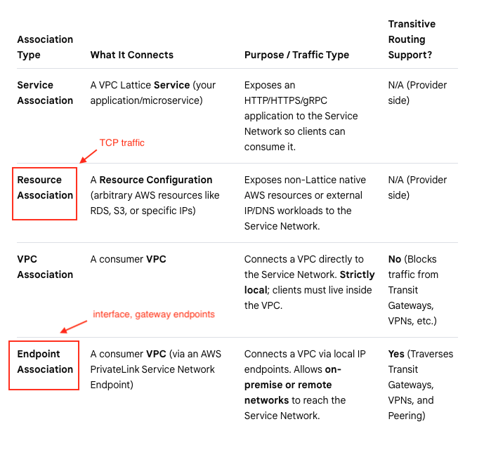

## Scenario
In this scenario, a Service Network is created in account-1 in us-east-1 region and shared with account-2 via RAM. The Service Network has a VPC association to the default VPC for account-1 in us-east-1 region, and a client ec2 is created in the VPC.

In account-2, an EC2 is created in the default vpc for the account in us-east-1 region hosting a web service. It is then configured as a target group. A Lattice Service is created and associated with account-1's Service Network. The Lattice Service is also configured with a routing rule which has a listener on port 80 pointing to the target group containing the web EC2 instance. 

The SG associated with the web EC2 instance is configured to allow port 80 from the source which is the lattice service network. 

Overall architecture

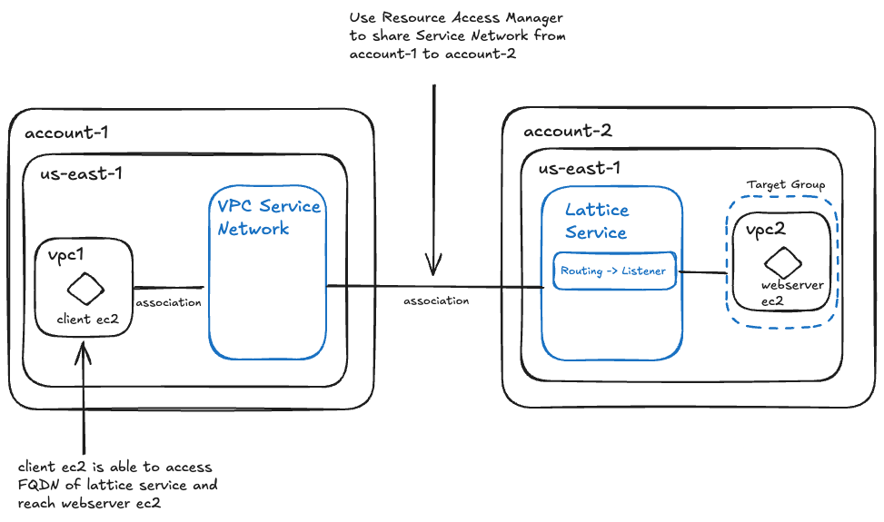

### On account 1 - Service Network and client EC2

---
Service network shared with account 2

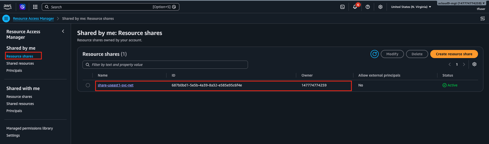
---
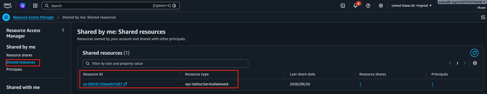

---
Service network showing association to Lattice Service from account 2

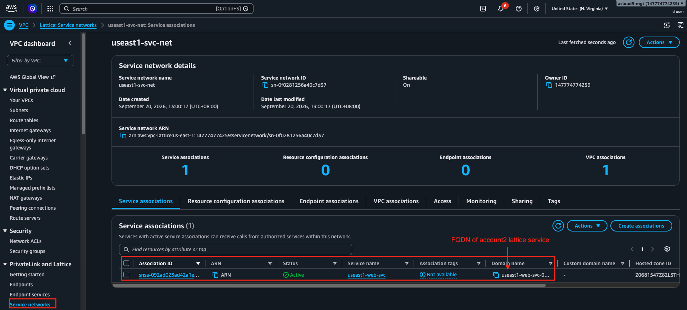
---
Service network showing association to default VPC in account 1 us-east-1

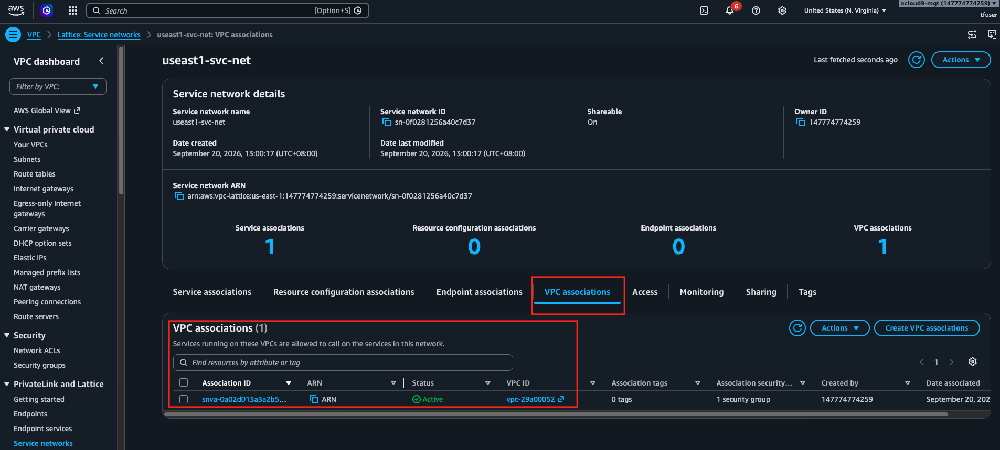
---
Security Group for client EC2 in account-1 default VPC in us-east-1

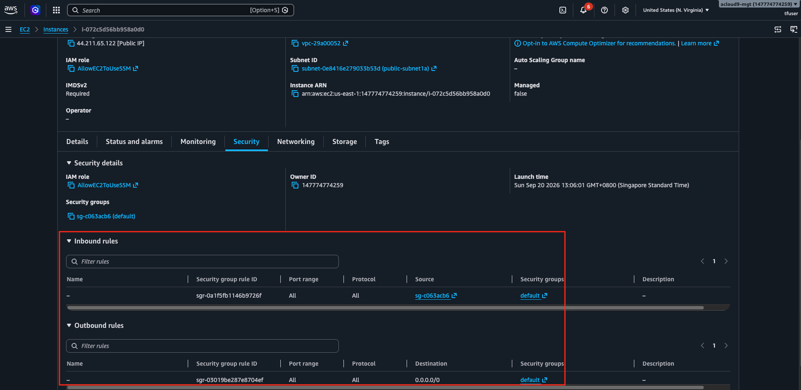
---
Route table for client EC2 in account-1 default VPC in us-east-1

Notice the injected routes pointing to VPC lattice network

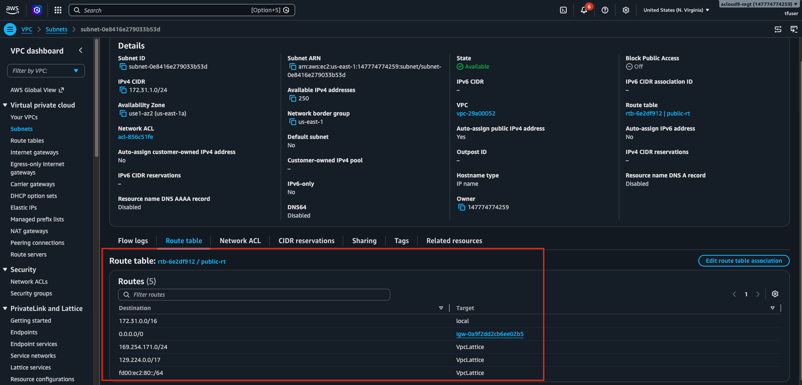
---
Verify the client ec2 in account 1 can access the web ec2 in account 2

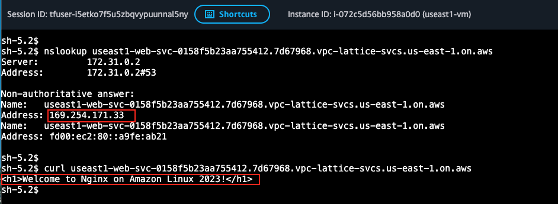

### On account 2 - Lattice Service and webserver EC2

---
Lattice Service showing association to Service Network for account-1

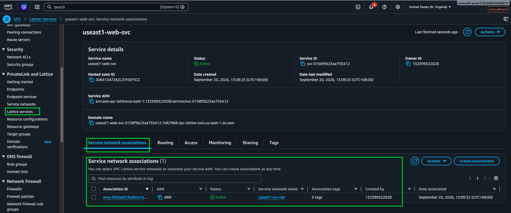

---
Lattice Service showing listener on port 80 with target group to webserver ec2

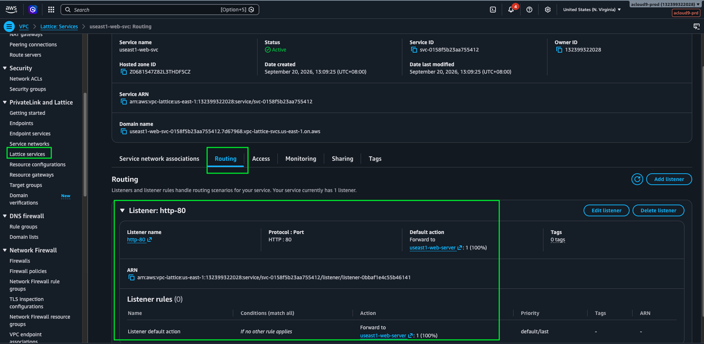

---
Target group containing webserver ec2

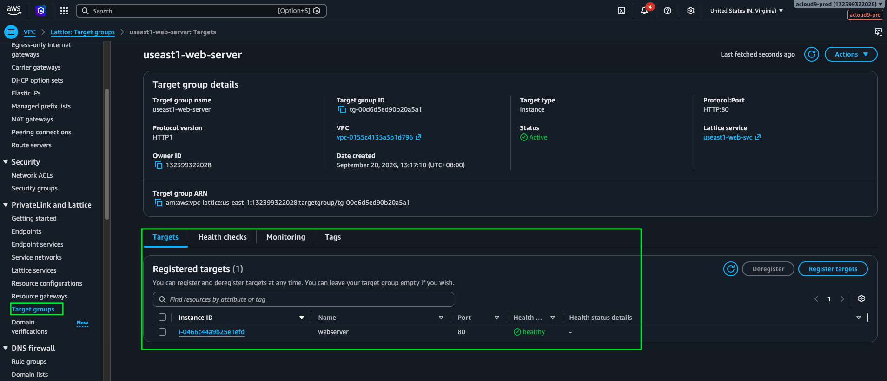

---
Security Group webserver ec2

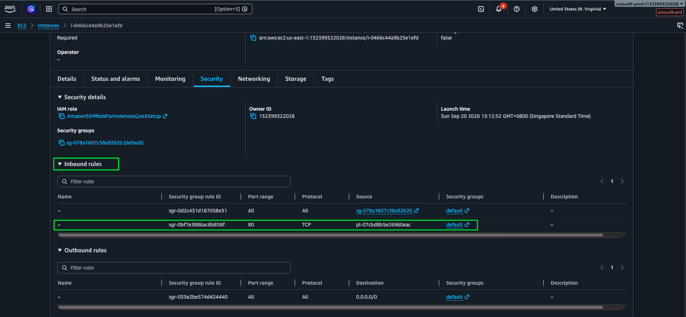

Notice it allows prefix-list of VPC lattice

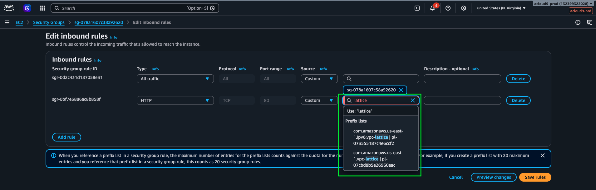

---
Account 2 sees Service Network shared by Account 1

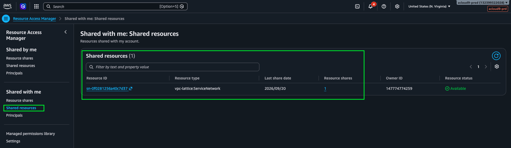

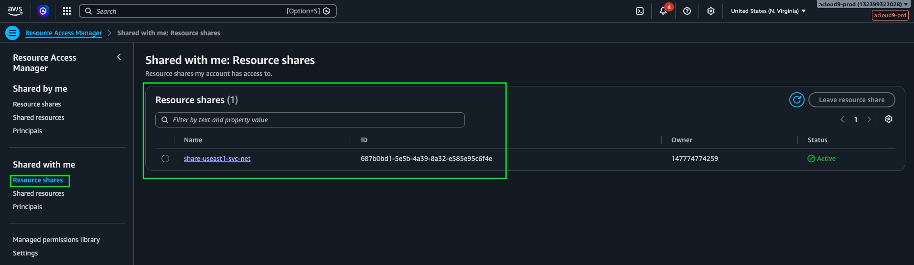