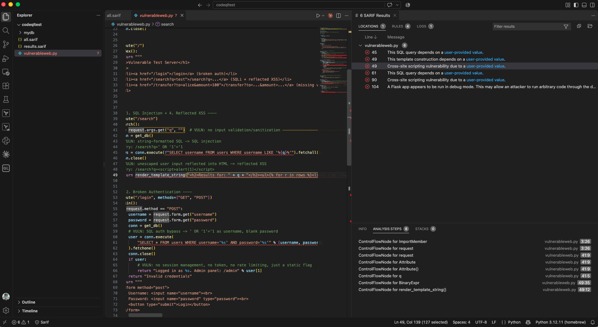

## How to use codeql CLI
This article provides an example of how you can use codeql cli to scan a piece of Python code for security issues, and how you can view the findings in Visual Studio Code


### Step 1 - install the CodeQL Bundle for your operating system

Go to https://github.com/github/codeql-action/releases and select one of the CodeQL Bundle options for your OS
---

### Step 2 - go to the root of your project folder containing the code to be scan and create a CodeQL database
```bash
codeql database create mydb --language=python
```
---

### Step 3 - run the codeql scan and specify the output in sarif format
Here we run only the CWE for SQL injection. Note that in this example, the CodeQL bundle is installed on my desktop

```bash
codeql database analyze mydb \
  /Users/jzwong/Desktop/codeql/qlpacks/codeql/python-queries/1.8.11/Security/CWE-089/SqlInjection.ql \
  --format=sarif-latest \
  --output=results.sarif

Running queries.
Resolving data extensions.
Finished resolving data extensions.
Loading data extensions.
Finished loading data extensions.
[1/1] Loaded /Users/jzwong/Desktop/codeql/qlpacks/codeql/python-queries/1.8.11/Security/CWE-089/SqlInjection.qlx.
SqlInjection.ql: [1/1 eval 1.1s] Results written to codeql/python-queries/Security/CWE-089/SqlInjection.bqrs.
Shutting down query evaluator.
Interpreting results.

jzwong ~/Desktop/codeqltest  $ ls -al
total 48
drwxr-xr-x   5 jzwong  staff    160 27 Sep 10:01 .
drwx------@ 46 jzwong  staff   1472 27 Sep 09:49 ..
drwxr-xr-x   9 jzwong  staff    288 27 Sep 10:01 mydb
-rw-r--r--   1 jzwong  staff  18574 27 Sep 10:01 results.sarif
-rw-r--r--@  1 jzwong  staff   3445 26 Sep 10:54 vulnerableweb.py  
```


### Step 4 - run codeql scan with default scanning profile

```bash
codeql database analyze mydb \
  --format=sarif-latest \
  --output=all.sarif

Running queries.
Resolving data extensions.
Finished resolving data extensions.
Loading data extensions.
Finished loading data extensions.
[1/45] Loaded /Users/jzwong/Desktop/codeql/qlpacks/codeql/python-queries/1.8.11/Security/CWE-094/CodeInjection.qlx.
[2/45] Loaded /Users/jzwong/Desktop/codeql/qlpacks/codeql/python-queries/1.8.11/Security/CWE-209/StackTraceExposure.qlx.
[3/45] Loaded /Users/jzwong/Desktop/codeql/qlpacks/codeql/python-queries/1.8.11/Security/CWE-601/UrlRedirect.qlx.
[4/45] Loaded /Users/jzwong/Desktop/codeql/qlpacks/codeql/python-queries/1.8.11/Security/CWE-1275/SameSiteNoneCookie.qlx.
[5/45] Loaded /Users/jzwong/Desktop/codeql/qlpacks/codeql/python-queries/1.8.11/Security/CWE-326/WeakCryptoKey.qlx.
[6/45] Loaded /Users/jzwong/Desktop/codeql/qlpacks/codeql/python-queries/1.8.11/Security/CWE-113/HeaderInjection.qlx.
[7/45] Loaded /Users/jzwong/Desktop/codeql/qlpacks/codeql/python-queries/1.8.11/Security/CWE-943/NoSqlInjection.qlx.
[8/45] Loaded /Users/jzwong/Desktop/codeql/qlpacks/codeql/python-queries/1.8.11/Security/CWE-327/InsecureDefaultProtocol.qlx.
[9/45] Loaded /Users/jzwong/Desktop/codeql/qlpacks/codeql/python-queries/1.8.11/Security/CWE-327/BrokenCryptoAlgorithm.qlx.
[10/45] Loaded /Users/jzwong/Desktop/codeql/qlpacks/codeql/python-queries/1.8.11/Security/CWE-327/InsecureProtocol.qlx.
[11/45] Loaded /Users/jzwong/Desktop/codeql/qlpacks/codeql/python-queries/1.8.11/Security/CWE-327/WeakSensitiveDataHashing.qlx.
[12/45] Loaded /Users/jzwong/Desktop/codeql/qlpacks/codeql/python-queries/1.8.11/Security/CWE-918/FullServerSideRequestForgery.qlx.
[13/45] Loaded /Users/jzwong/Desktop/codeql/qlpacks/codeql/python-queries/1.8.11/Security/CWE-285/PamAuthorization.qlx.
[14/45] Loaded /Users/jzwong/Desktop/codeql/qlpacks/codeql/python-queries/1.8.11/Security/CWE-614/InsecureCookie.qlx.
[15/45] No need to rerun /Users/jzwong/Desktop/codeql/qlpacks/codeql/python-queries/1.8.11/Security/CWE-089/SqlInjection.ql.
[16/45] Loaded /Users/jzwong/Desktop/codeql/qlpacks/codeql/python-queries/1.8.11/Security/CWE-074/TemplateInjection.qlx.
[17/45] Loaded /Users/jzwong/Desktop/codeql/qlpacks/codeql/python-queries/1.8.11/Security/CWE-020/IncompleteHostnameRegExp.qlx.
[18/45] Loaded /Users/jzwong/Desktop/codeql/qlpacks/codeql/python-queries/1.8.11/Security/CWE-020/CookieInjection.qlx.
[19/45] Loaded /Users/jzwong/Desktop/codeql/qlpacks/codeql/python-queries/1.8.11/Security/CWE-020/IncompleteUrlSubstringSanitization.qlx.
[20/45] Loaded /Users/jzwong/Desktop/codeql/qlpacks/codeql/python-queries/1.8.11/Security/CWE-020/OverlyLargeRange.qlx.
[21/45] Loaded /Users/jzwong/Desktop/codeql/qlpacks/codeql/python-queries/1.8.11/Security/CWE-215/FlaskDebug.qlx.
[22/45] Loaded /Users/jzwong/Desktop/codeql/qlpacks/codeql/python-queries/1.8.11/Security/CWE-090/LdapInjection.qlx.
[23/45] Loaded /Users/jzwong/Desktop/codeql/qlpacks/codeql/python-queries/1.8.11/Security/CVE-2018-1281/BindToAllInterfaces.qlx.
[24/45] Loaded /Users/jzwong/Desktop/codeql/qlpacks/codeql/python-queries/1.8.11/Security/CWE-295/MissingHostKeyValidation.qlx.
[25/45] Loaded /Users/jzwong/Desktop/codeql/qlpacks/codeql/python-queries/1.8.11/Security/CWE-377/InsecureTemporaryFile.qlx.
[26/45] Loaded /Users/jzwong/Desktop/codeql/qlpacks/codeql/python-queries/1.8.11/Security/CWE-116/BadTagFilter.qlx.
[27/45] Loaded /Users/jzwong/Desktop/codeql/qlpacks/codeql/python-queries/1.8.11/Security/CWE-776/XmlBomb.qlx.
[28/45] Loaded /Users/jzwong/Desktop/codeql/qlpacks/codeql/python-queries/1.8.11/Security/CWE-312/CleartextStorage.qlx.
[29/45] Loaded /Users/jzwong/Desktop/codeql/qlpacks/codeql/python-queries/1.8.11/Security/CWE-312/CleartextLogging.qlx.
[30/45] Loaded /Users/jzwong/Desktop/codeql/qlpacks/codeql/python-queries/1.8.11/Security/CWE-352/CSRFProtectionDisabled.qlx.
[31/45] Loaded /Users/jzwong/Desktop/codeql/qlpacks/codeql/python-queries/1.8.11/Security/CWE-502/UnsafeDeserialization.qlx.
[32/45] Loaded /Users/jzwong/Desktop/codeql/qlpacks/codeql/python-queries/1.8.11/Security/CWE-730/RegexInjection.qlx.
[33/45] Loaded /Users/jzwong/Desktop/codeql/qlpacks/codeql/python-queries/1.8.11/Security/CWE-730/ReDoS.qlx.
[34/45] Loaded /Users/jzwong/Desktop/codeql/qlpacks/codeql/python-queries/1.8.11/Security/CWE-730/PolynomialReDoS.qlx.
[35/45] Loaded /Users/jzwong/Desktop/codeql/qlpacks/codeql/python-queries/1.8.11/Security/CWE-1004/NonHttpOnlyCookie.qlx.
[36/45] Loaded /Users/jzwong/Desktop/codeql/qlpacks/codeql/python-queries/1.8.11/Security/CWE-022/PathInjection.qlx.
[37/45] Loaded /Users/jzwong/Desktop/codeql/qlpacks/codeql/python-queries/1.8.11/Security/CWE-611/Xxe.qlx.
[38/45] Loaded /Users/jzwong/Desktop/codeql/qlpacks/codeql/python-queries/1.8.11/Security/CWE-078/CommandInjection.qlx.
[39/45] Loaded /Users/jzwong/Desktop/codeql/qlpacks/codeql/python-queries/1.8.11/Security/CWE-643/XpathInjection.qlx.
[40/45] Loaded /Users/jzwong/Desktop/codeql/qlpacks/codeql/python-queries/1.8.11/Security/CWE-079/ReflectedXss.qlx.
[41/45] Loaded /Users/jzwong/Desktop/codeql/qlpacks/codeql/python-queries/1.8.11/Expressions/UseofInput.qlx.
[42/45] Loaded /Users/jzwong/Desktop/codeql/qlpacks/codeql/python-queries/1.8.11/Diagnostics/ExtractedFiles.qlx.
[43/45] Loaded /Users/jzwong/Desktop/codeql/qlpacks/codeql/python-queries/1.8.11/Diagnostics/ExtractionWarnings.qlx.
[44/45] Loaded /Users/jzwong/Desktop/codeql/qlpacks/codeql/python-queries/1.8.11/Summary/LinesOfCode.qlx.
[45/45] Loaded /Users/jzwong/Desktop/codeql/qlpacks/codeql/python-queries/1.8.11/Summary/LinesOfUserCode.qlx.
ExtractedFiles.ql                    : [1/44 eval 66ms] Results written to codeql/python-queries/Diagnostics/ExtractedFiles.bqrs.
ExtractionWarnings.ql                : [2/44 eval 9ms] Results written to codeql/python-queries/Diagnostics/ExtractionWarnings.bqrs.
UseofInput.ql                        : [3/44 eval 154ms] Results written to codeql/python-queries/Expressions/UseofInput.bqrs.
BindToAllInterfaces.ql               : [4/44 eval 35ms] Results written to codeql/python-queries/Security/CVE-2018-1281/BindToAllInterfaces.bqrs.
CookieInjection.ql                   : [5/44 eval 92ms] Results written to codeql/python-queries/Security/CWE-020/CookieInjection.bqrs.
IncompleteHostnameRegExp.ql          : [6/44 eval 2ms] Results written to codeql/python-queries/Security/CWE-020/IncompleteHostnameRegExp.bqrs.
IncompleteUrlSubstringSanitization.ql: [7/44 eval 11ms] Results written to codeql/python-queries/Security/CWE-020/IncompleteUrlSubstringSanitization.b
OverlyLargeRange.ql                  : [8/44 eval 1ms] Results written to codeql/python-queries/Security/CWE-020/OverlyLargeRange.bqrs.
PathInjection.ql                     : [9/44 eval 45ms] Results written to codeql/python-queries/Security/CWE-022/PathInjection.bqrs.
TemplateInjection.ql                 : [10/44 eval 322ms] Results written to codeql/python-queries/Security/CWE-074/TemplateInjection.bqrs.
CommandInjection.ql                  : [11/44 eval 15ms] Results written to codeql/python-queries/Security/CWE-078/CommandInjection.bqrs.
ReflectedXss.ql                      : [12/44 eval 202ms] Results written to codeql/python-queries/Security/CWE-079/ReflectedXss.bqrs.
LdapInjection.ql                     : [13/44 eval 24ms] Results written to codeql/python-queries/Security/CWE-090/LdapInjection.bqrs.
CodeInjection.ql                     : [14/44 eval 15ms] Results written to codeql/python-queries/Security/CWE-094/CodeInjection.bqrs.
NonHttpOnlyCookie.ql                 : [15/44 eval 5ms] Results written to codeql/python-queries/Security/CWE-1004/NonHttpOnlyCookie.bqrs.
HeaderInjection.ql                   : [16/44 eval 15ms] Results written to codeql/python-queries/Security/CWE-113/HeaderInjection.bqrs.
BadTagFilter.ql                      : [17/44 eval 2ms] Results written to codeql/python-queries/Security/CWE-116/BadTagFilter.bqrs.
SameSiteNoneCookie.ql                : [18/44 eval 14ms] Results written to codeql/python-queries/Security/CWE-1275/SameSiteNoneCookie.bqrs.
StackTraceExposure.ql                : [19/44 eval 17ms] Results written to codeql/python-queries/Security/CWE-209/StackTraceExposure.bqrs.
FlaskDebug.ql                        : [20/44 eval 4ms] Results written to codeql/python-queries/Security/CWE-215/FlaskDebug.bqrs.
PamAuthorization.ql                  : [21/44 eval 8ms] Results written to codeql/python-queries/Security/CWE-285/PamAuthorization.bqrs.
MissingHostKeyValidation.ql          : [22/44 eval 2ms] Results written to codeql/python-queries/Security/CWE-295/MissingHostKeyValidation.bqrs.
CleartextLogging.ql                  : [23/44 eval 10ms] Results written to codeql/python-queries/Security/CWE-312/CleartextLogging.bqrs.
CleartextStorage.ql                  : [24/44 eval 29ms] Results written to codeql/python-queries/Security/CWE-312/CleartextStorage.bqrs.
WeakCryptoKey.ql                     : [25/44 eval 2ms] Results written to codeql/python-queries/Security/CWE-326/WeakCryptoKey.bqrs.
BrokenCryptoAlgorithm.ql             : [26/44 eval 2ms] Results written to codeql/python-queries/Security/CWE-327/BrokenCryptoAlgorithm.bqrs.
InsecureDefaultProtocol.ql           : [27/44 eval 2ms] Results written to codeql/python-queries/Security/CWE-327/InsecureDefaultProtocol.bqrs.
InsecureProtocol.ql                  : [28/44 eval 20ms] Results written to codeql/python-queries/Security/CWE-327/InsecureProtocol.bqrs.
WeakSensitiveDataHashing.ql          : [29/44 eval 9ms] Results written to codeql/python-queries/Security/CWE-327/WeakSensitiveDataHashing.bqrs.
CSRFProtectionDisabled.ql            : [30/44 eval 2ms] Results written to codeql/python-queries/Security/CWE-352/CSRFProtectionDisabled.bqrs.
InsecureTemporaryFile.ql             : [31/44 eval 1ms] Results written to codeql/python-queries/Security/CWE-377/InsecureTemporaryFile.bqrs.
UnsafeDeserialization.ql             : [32/44 eval 17ms] Results written to codeql/python-queries/Security/CWE-502/UnsafeDeserialization.bqrs.
UrlRedirect.ql                       : [33/44 eval 12ms] Results written to codeql/python-queries/Security/CWE-601/UrlRedirect.bqrs.
Xxe.ql                               : [34/44 eval 10ms] Results written to codeql/python-queries/Security/CWE-611/Xxe.bqrs.
InsecureCookie.ql                    : [35/44 eval 1ms] Results written to codeql/python-queries/Security/CWE-614/InsecureCookie.bqrs.
XpathInjection.ql                    : [36/44 eval 6ms] Results written to codeql/python-queries/Security/CWE-643/XpathInjection.bqrs.
PolynomialReDoS.ql                   : [37/44 eval 3ms] Results written to codeql/python-queries/Security/CWE-730/PolynomialReDoS.bqrs.
ReDoS.ql                             : [38/44 eval 1ms] Results written to codeql/python-queries/Security/CWE-730/ReDoS.bqrs.
RegexInjection.ql                    : [39/44 eval 5ms] Results written to codeql/python-queries/Security/CWE-730/RegexInjection.bqrs.
XmlBomb.ql                           : [40/44 eval 9ms] Results written to codeql/python-queries/Security/CWE-776/XmlBomb.bqrs.
FullServerSideRequestForgery.ql      : [41/44 eval 12ms] Results written to codeql/python-queries/Security/CWE-918/FullServerSideRequestForgery.bqrs.
NoSqlInjection.ql                    : [42/44 eval 99ms] Results written to codeql/python-queries/Security/CWE-943/NoSqlInjection.bqrs.
LinesOfCode.ql                       : [43/44 eval 3ms] Results written to codeql/python-queries/Summary/LinesOfCode.bqrs.
LinesOfUserCode.ql                   : [44/44 eval 36ms] Results written to codeql/python-queries/Summary/LinesOfUserCode.bqrs.
Shutting down query evaluator.
Interpreting results.
CodeQL scanned 1 out of 1 Python files in this invocation. Typically CodeQL is configured to analyze a single CodeQL language per invocation, so check other invocations to determine overall coverage information.
```
---

### Step 5 - install the Sarif Viewer extension on Visual Studio Code from Microsoft DevLabs
After installing the Sarif Viewer extension on VS code, you can click on the sarif file and it will show the issues and where they are found in the code


---

### Step 6 (Optional) - run the scan with security-extended query suite

```bash
codeql database analyze mydb \
/Users/jzwong/Desktop/codeql/qlpacks/codeql/python-queries/1.8.11/codeql-suites/python-security-extended.qls \
  --format=sarif-latest \
  --output=security-extended.sarif
```
---


## Notes:
- Differences between Default, Security Extended scans in Python - https://docs.github.com/en/code-security/reference/code-scanning/codeql/codeql-queries/python-built-in-queries
- Types of query suites in CodeQL - https://docs.github.com/en/code-security/concepts/code-scanning/codeql/codeql-query-suites